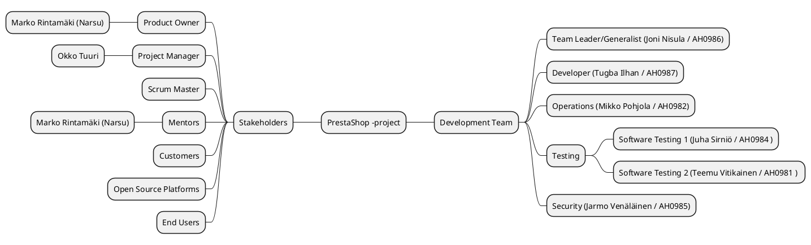
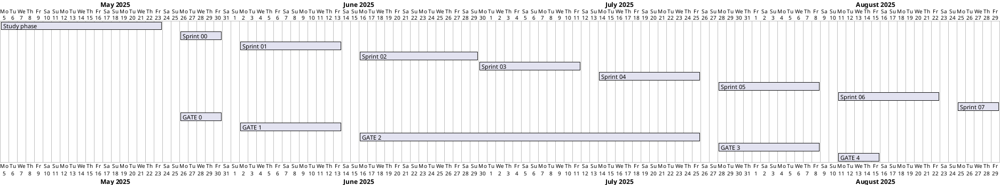

# Project Plan

| | |
|:------: |:--: |
| Document | Project Plan for ECSP1 Project |
| Author:  | Joni Nisula (Team Leader), Jarmo Venäläinen (security), Juha Sirniö (Tester) |
| Version: | v1.0 |
|  Date:   |  6.6.2025 |

<!--  -->

# 1. Project in general

## 1.1 background and starting points

<!-- >Describe the assignment briefly in the form of an introduction.If necessary, a reader will read more closely to the requirement definition document.The aim of the project is to try to combine
There is a need to develop "objects ..." project implemented within the OPF framework TTOS2070 Guideline Institute of Jyväskylä University of Applied Sciences.*
The item is often a wider concept than the actual project to be defined.The item describes in a clear way, often relying on the graphic presentation, what kind of system assembly or activity
is involved in doing something in the project in a project of something sub-assembly / supplement.This is therefore described in the current system and the customer's current approach. -->

The project is about creation of a PrestaShop -based eCommerce platform. PrestaShop is an open source e-commerce solution. Such a service can be distributed with some amount of modification to other companies who want to sell products online. Service must be fast, reliable, easy to maintain and secure enough for transactions.

## 1.2 Goals and tasks

<!-- >This document describes the background, objectives, tasks, phase distribution, resources and organization of the X project.Each step is described separately in connection with the phase division. "
>This may refer to the content definition content
>Defining the most important content of the job in this project;The task of the project is related to the total project described in the project.
>What action is to be developed and how?>
>A vision of a future state
>What is the result of the outcome (concrete)?
>What are the partial or intermediate results?>
>What are people, actors or groups associated with the project project
>This can be accompanied by a stakeholder description or use as a source of claim definition?
*Link to the required material in claim definition -->

The goal of this project is to build a eCommerce service that can be sold further with modifications required by the further customers. The team has been provided PrestaShop -service as a baseline for the development of the final product.

### What and How

The main task of this project is to containerize PrestaShop, an open-source e-commerce platform, and integrate it with MariaDB, a widely used open-source relational database management system. Containerization is a method of packaging software along with all its necessary components into isolated units called containers. 

To achieve this, we will use Docker, a platform designed specifically for containerization. Docker simplifies the process of setting up and managing these containers, making it easier for developers to work in a consistent and reproducible environment.

In addition, we will utilize Docker Compose, a tool that allows us to define and manage multi-container applications using a simple YAML configuration file. This makes it straightforward to coordinate services like PrestaShop and MariaDB, ensuring they work together seamlessly.

The setup will also support mounting local code into the running container, allowing developers to see real-time changes without restarting the environment. Furthermore, the project will include HTTPS support for secure communication, authentication mechanisms to control access, and efficient bug tracking to maintain system stability and security.

### Vision

The future state includes a fully operational and scalable PrestaShop service running in a containerized environment. This setup will support secure online transactions, easy maintenance, and seamless integrations with payment gateways, ensuring a developer-friendly ecosystem that enhances productivity and deployment efficiency, while providing the best service to customers in their shopping experiences.

### Features to be delivered.

More info in [Product mind map](../20-Requirement-management/product-mind-map.md#product-feature-mind-map)

## 1.3 Limitations and interfaces

<!-- >Specifying the task of the project by limiting external parts of the target system or overall project.
>Separately, it is also possible to describe external factors significantly restrictive of performing the task.This also specifies them
>Task cases which are now likely to be associated with the mission at some point, but not
>In the framework of this project, however, it will be implemented.Typical such tasks could be, for example,Operating environment
>Construction and training.Other limits could be, for example, the language used in the software interface. -->

This section defines the limitations and interfaces of the webshop project. This includes specifying external factors that can impact the implementation of the project.

Limitations:

1. **Cloud service availability** As the webstore will be running on CSC's cPouta cloud service, any interruptions to their service are out of our contror unless we are to create a backup service to a different server for redundancy's sake.
2. **Technological constraints** As the framework is designated by the assignment, the development of the project is tied to limitations that come with PrestaShop, currently unknown.
3. **Time constraints** As the project has a set starting and ending time over which the time reserved to it is shared with other concurrent coursework, the project features will require prioritization and scaling in relation to the team's experience and technical proficiency.
4. **Resource Limitations** Limitations on hardware, software and human resources will impose constraints to the project scope.

## 1.4 Rights and IPR

<!-- >"The rights of the various parties are defined in the project agreement."Unless a separate agreement has been told about the rights of the job, they must express, for example, in this project plan. -->

The rights and intellectual property (IP) ownership for the deliverables created in this project are determined by the overarching project agreement. Unless otherwise specified in a separate written contract, the following general principles apply:

### Ownership of Deliverables

All custom code, documentation, and configurations developed within the scope of this project belong to the project team or commissioning party as defined in the project agreement. Third-party libraries, frameworks, or plugins (e.g., PrestaShop, Docker images, payment gateway modules) remain subject to their respective open-source or commercial licenses.

### Licensing

Any newly created software components or modifications to existing open-source components will be licensed in a manner consistent with the original licenses (e.g., GPL, MIT), unless otherwise agreed. If a specific open-source or proprietary license is chosen for the project’s deliverables, it will be explicitly stated in the project agreement or final documentation.

### Use of Project Outputs

The commissioning party (or investor) may use the project outputs—such as containerized PrestaShop instances and accompanying scripts—internally or commercially, subject to any third-party license restrictions. The project team retains the right to reference non-confidential portions of the work for portfolio or academic demonstration purposes, unless otherwise restricted by a confidentiality clause.

### Branding and Trademarks

Any branding, trademarks, or service marks used within the project remain the property of their respective owners. The project team does not claim ownership of any external brands integrated into the system.

### Future Modifications

Should the investor or any subsequent party wish to extend, modify, or re-license the project deliverables, such activities must respect the original license terms and any separate agreements in place.

In the event of conflicting interpretations or future changes, an addendum or amendment to the project agreement will clarify the allocation of rights and IPR for all parties involved.

## 1.5 terms and definitions

Full alphabetical list of terms and definitions used in this project plan can be found [here](../10-Project-management/terms-and-definitions.md).

## 1.6 Risk Management  

### 1.6.1 General Risk Management Overview

At a general level, project risk management focuses on strategic and organizational risks. The project team includes a designated security role responsible for general threat monitoring. The security officer reports issues related to their responsibilities to the team leader and ensures that all team members are aware of identified risks, mitigation strategies, and planned countermeasures.

An initial threat assessment was conducted during Sprint 1, using common and accessible sources (e.g., online articles, previous projects, etc.). Additional insights were gathered from previous e-commerce platform projects relevant to the current context. Large Language Models (LLMs) were also employed as analytical tools to identify and map potential risks. The outputs from the LLMs were reviewed and evaluated by the team’s security lead.

The outcome of this process is a centralized [risk list](./risk-management.md), which serves as a living document throughout the project. It is reviewed and updated as needed based on ongoing observations, team reflections, and new developments.

Each team member is responsible for monitoring and assessing potential or emerging risks within their area of responsibility and reporting them to the team leader. Members are also expected to notify relevant team roles (e.g., security, admin) if risks pertain to specific functional areas. Responsibilities related to risk ownership are detailed in the [risk list](./risk-management.md); general team member responsibilities are available on the [team page](./team-introduction.md).

The [risk list](./risk-management.md) also includes:

- short descriptions of the risks,
- guidelines and examples for assessing the potential impact of an event on project workflow,
- criteria for evaluating the likelihood of risks, and
- predefined mitigation strategies for selected risk scenarios.

### 1.6.2 Identified Organizational, Strategic, and Personnel-Related Risks

The following risks have been classified as organizational, strategic, or related to personnel:

| Risk ID  | Description                          | Category                         |
|----------|--------------------------------------|----------------------------------|
| RIS001   | Project scope creep                  | Organizational / Strategic       |
| RIS002   | Lack of resources (skills, personnel)| Organizational / Strategic       |
| RIS003   | Illness of a team member             | Personnel-related                |
| RIS004   | Communication issues                 | Organizational                   |
| RIS005   | Schedule slippage                    | Strategic                        |
| RIS006   | Unclear goals and vision             | Strategic                        |
| RIS007   | Lack of motivation                   | Personnel-related                |
| RIS008   | Overlapping work                     | Organizational                   |
| RIS009   | Unclear responsibilities             | Organizational                   |
| RIS010   | Loss of a team member                | Personnel-related                | 

As outlined above, [mitigation strategies](./risk-management.md) have been identified for each of these risks. Key preventive measures include maintaining consistent communication between team members and the team leader, and ensuring careful planning throughout the project.

The team meets regularly in daily scrums to inspect progress and adapt if needed. In addition, retrospective meetings are held at the end of each two-week sprint to reflect on team performance and identify areas for improvement. A dedicated Discord channel is used for project-wide communication and for discussing project-specific issues such as emerging risks.

### 1.6.3 Documentation of Identified Risks

* Link to current full [risk list](./risk-management.md)

# 2. Project organization

## 2.1 Internal Team Organization

<!-- > Who belongs to the project organization?Does the project group / team have other operators?
> Project Group Instruments and Client Representatives.The organizational chart is presented in the appendix or in the description below. -->

**Structure of Project Organization as MindMap**

## 2.2 Responsibilities, Resources and decision-making process

<!-- >This includes the responsibilities of all project organizations (eg management team, project manager, secretary, group,> supervisors) and the decision-making process (eg, the project manager prepares and presents the management team to decide ...) -->

**Project Team/Group and resources as worktime**

|  Name | Responsibility | Company/Community | Estimated max worktime |
|:-:|:-:|:-:|:-:|
| Joni Nisula |  Team Leader/Generalist  | DevLetics | ? |
| Tugba Ilhan | Developer | DevLetics | ? |
| Mikko Pohjola | Operations/Adminstrator | DevLetics | ? |
| Juha Sirniö |  Software Testing 1 | DevLetics | ? |
| Teemu Vitikainen | Software Testing 2 | DevLetics | ? |
| Jarmo Venäläinen| Security | DevLetics | ? |

<!-- >"The project team performs the tasks set by the Management Team for the project within the scope of the available resources.> During the project, the roles of the master and the secretary of the group circulate within the group so that each member of the group works> once in either role. " -->

**Board Members**

<!-- > "The management team constitutes elected representatives of the project group, instructors and the client.Other persons, such as experts, may also be invited to meet the management team meetings.The configuration of the management team is presented> in Annex to the Project Agreement <x>. " -->

|  Name       | Responsibility | Company/Community |
|:---:|:--:|:-------: |
| Marko Rintamäki (Narsu) | Product Owner & Mentor  | - |
| Okko Tuuri | Project Manager | - |

### **External Stakeholder Profiles**

|                              Name       | Responsibility       |Company/Community  |
|:-:|:-----:|:-----:|
| [**Clients (Business Owners)**](../20-Requirement-management/Stakeholder%20Profiles/stakeholder_business_owner.md) |  eCommerce Service Users | Various Businesses |
| [**End Customers**](../20-Requirement-management/Stakeholder%20Profiles/stakeholder_product_owner.md) | Product Vision | ? |

## 2.3.Project Steps and Financial Objectives

<!-- >Task cases, bidding and phasening, intermediate results, schedules and resource plans, budget -->

Project steps are defined through sprints and gates.
Financial goals to fund the project are detailed in 3.2 cost estimation and in offer to the stakeholders.

## 2.4.Quality verification

<!-- >Methods, standards, approval procedures, change management, documentation, reviews, risk management, Other complementary plans -->
Quality verification ensures that the product meets the defined requirements and quality standards. This includes activities such as product testing and quality assurance, which are discussed in more detail in the [Master Test Plan](../50-Test-management/master-test-plan.md).

## 2.5.Communication and tracking of project progress

<!-- > Getting Started, Workspaces and Communications, Packaging Policy and Connection, Reporting, Reporting and Information, Project Folder -->

The platform for project management will be GitLab, where all the project files, issues and planning will be held. The team is cabable to use the necessary tools for delivering the necessary feastures for the final product. This includes robot frameworks for testing, Docker as a publishing platform etc.

Updates are frequently published to [Team's status update page](../00-Current-status/current-status.md). This is team's way to report the outer world theis progress. The final report of the project will be delivered at the end of the Project.

More information about communication in the Team's [Communication Plan](../10-Project-management/communication-plan.md).

## 2.6.The end of the project

Project ends on 29.8.2025

# 3. Schdule and Gates

## 3.1 GANTT 

<!-- >The progress of the project can be described as a ns.With a Gantt chart.It can be used to show the progress of different phases with a timeline, while showing the critical points associated with different tasks. -->

**Recap GANTT using with PlantUML**

<!-- >The partition of the project refers to the distribution of the project to clear sub-assemblies and similar executions (subprojects, phases, tasks and tasks). >> The progress of research and development projects is characterized by the formation of the outcome and the step of focusing the Gate by step. The partition of the project should be based on this starting point (also applies to>> IT Institute's student projects).

>The project life cycle can be divided into different types of phases. At each stage, certain products are produced, such as a statement, plans, prototype, device, etc. to the end of each stage to complete evaluation, acceptance or review. The software project is typically divided into seven steps: establishment, pre-study, analysis, design, implementation, testing and quitting. Sometimes a preliminary study has its own project, sometimes analysis is included in design, etc. Testing may not necessarily have its own phase, but is included in all stages. Often proceeded incrementally, ie first planned and implemented one thing in its entirety before proceeding to the next issue. There is no single "correct" phase distribution, but if the commissioner has its own method and related templates, both student projects are primarily used. More often, agile application development is used, that is, the software is made in 1-4 weeks sprints.

>What are the Gates / steps of the project? (A brief description for each)> <What results for each step is generated? > -->

### Gates

<!-- The next step is each step, the time resources and results they require in briefly.The steps and their tasks are described in more detail in the phase plans.The ongoing phase of the current stage should be known precisely who is doing and how much work to perform this step.Later phases work estimates can be made at an early stage at a rough level, which is then refined to a detailed level of the project.This happens at the end of each phase to be designed in more detail the next step.

Note: The following are the startup and ending steps.Of all the phases of the project, their duration and workloads, the so-called Gantt chart (attached), which also shows the interdependencies between the steps and the main easses (e.g., the management team meeting date of the management team). -->

**Make sure links are targeted your project**

**[Milestone GATE 0](https://gitlab.labranet.jamk.fi/ohtu-project/core/-/milestones/1#tab-issues)**

Setting up the team, deciding the name for the team and choosing the Team leader and the manager.

**[Milestone GATE 1](https://gitlab.labranet.jamk.fi/ohtu-project/core/-/milestones/2#tab-issues)**

Offer of the project will be presented for the customer.
)**

Checkpoint for the production so far to see how far we have progressed the Project so far (also known as reality check). Some major changes will happen on during gate.

**[Milestone - GATE 2](https://gitlab.labranet.jamk.fi/ohtu-project/core/-/milestones/3#tab-issues)**

**[Milestone - GATE 3](https://gitlab.labranet.jamk.fi/ohtu-project/core/-/milestones/4#tab-issues)**

Demo day for the current version of the PrestaShop-based product.

**[Milestone - GATE 4](https://gitlab.labranet.jamk.fi/ohtu-project/core/-/milestones/5#tab-issues)**

The termination phase includes measures to terminate the project.During the phase, the project team will draw up a project final report and the performance team. During the phase, the project's result for the contractor is considered the last management team meeting in week x and unloading the project organization.The closing phase results in the final report of the project.

## 3.2 Project preliminary cost estimate

Bring your cost estimate visible at this section by using image capture and file upload. 

* [**Link to latest Cost Estimation and Feature Pricing in .ods -format**](assets/cost_estimate.ods)

# 4. Quality assurance

<!-- > Working methods, instruments, instructions and standards applicable in the project
> This section lists all the methods, tools and standards to be used in version numbers. Often the commissioner has a method of complying with the project team. The client can also determine the appellants to be followed. Otherwise, the project team will tailor the model approved by the IT Institute's template for themselves and approved by the client. The course sets certain requirements for project monitoring tools and reporting that should be taken into account. However, the course does not forced a certain way to use tools, so there is a need to make a plan for this. The basics of information and version management of the project must be clarified so that all project stakeholders know the location of the latest versions of the documents. From the project plan and all other key documents of the project will become several versions that need to be added to the history history to monitor the development of the project afterwards. If a single device or software rises to the critical position of the project's implementation, it is good to designate this person who knows the person who knows. From the device or software group best. Here's a list of things that you should design and document:##  -->

The goal of the project is to produce a product that meets the [requirements](./docs/20-Requirement-management/requirement-specification.md) and objectives defined during the planning phase. In addition to functional features, special attention is paid to reliability, information security, and compliance with regulations (e.g., GDPR). The service should also be easily maintainable and performant.

The project is guided by a scheduled roadmap based on the selected features, which also defines checkpoints and gate reviews during the project lifecycle.

From the perspective of quality assurance, the project follows a DevSecOps approach, where development, testing, and deployment are continuous, and security is integrated throughout. In parallel, the Scrum framework is applied, dividing work into two-week sprints with review points at the end of each sprint.

Tasks are organized and tracked using GitLab's issue board, allowing clear ownership, progress tracking, and approval. Daily scrum meetings are used to monitor the status of tasks, each of which has at least two responsible persons—one ensuring task acceptance and completion.

The development platform is built on GitLab’s CI/CD functionalities, which provide automated workflows for version control, testing, building, and deployment. Automation helps streamline development and ensures consistent quality. 

Both the development and production environments are fully containerized using Docker, which ensures consistency from local development all the way to deployment. This container-based approach simplifies testing, enhances portability, and enables reliable and reproducible builds.

During the planning phase, time has been specifically allocated for skill development within the team to ensure both efficient execution and a high-quality outcome. In line with this, the project has been designed with a certain degree of flexibility regarding the tools used. This flexibility allows the team to adopt new or complementary tools if they are found to support project goals—especially as team members expand their expertise during the course of the project.

All code changes are subject to an approval process before being merged into the main branch. Throughout development, all relevant tools, code changes, risks, quality issues, and solutions are systematically documented, for example, in sprint-specific DoDs or the final report. Documentation supports traceability, transparency, repeatability, and collaborative development.

Finally, the technologies, tools, and standards used in this project — along with their version numbers — are as follows:
- PrestaShop 1.7.8.0
- PHP v7.4
- GitLab CI/CD (GitLab Enterprise Edition v17.11.4-ee)
- Docker v25.0 (?)
- MySQL 8.0
- ISTQB testing principles
- OWASP Top 10 (2021)
- GDPR (EU 2016/679)

**Note:** The list may be updated if new supporting tools or libraries are introduced during the project. However, **there is a strong recommendation against making changes to core technologies** — such as PHP, Docker, or MariaDB — **during the project**, unless there is a critical and well-justified reason to do so.

## 4.1 Approval of intermediate and results

<!-- > This will record the approval procedure, which is agreed on the project. -->

The approval process for intermediate results and final deliverables is integrated into our Agile workflow, which is based on two-week sprints and regular Gate reviews. 

At the end of each sprint, a Sprint Review meeting is held, where the team, together with the Team Leader and supervisor reviews the list of completed issues on the Kanban board. Each ticket is evaluated according to our definition of done and acceptance criteria. 

Testers are responsible for reviewing and verifying all tickets that impact the product’s behavior, quality, or deliverables. They do not need to review tickets that are unrelated to the product’s functionality or quality (such as purely administrative or documentation tasks). This ensures that all relevant changes are properly tested and meet the required standards before being marked as done. 

The supervisor is responsible for the official approval of both intermediate results and the final deliverable. The customer participates only in Gate reviews, providing feedback and suggestions at these key checkpoints. However, the final acceptance decision in this project is made by the supervisor. 

Gate reviews serve as additional checkpoints for evaluating project progress and confirming that major milestones have been achieved according to plan. 

If our process evolves to include feature demonstrations in sprint reviews, we will update this approval process accordingly to ensure alignment with Agile best practices. 

## 4.2 Manage changes

<!-- > Describe a change management procedure for project practices or changes related to the project's results. -->

Change management in our project is based on Agile practices and continuous improvement. The team regularly evaluates its working methods and project practices during retrospectives, which are held at the end of each two-week sprint.

During each retrospective, team members discuss what went well, what could be improved, and identify any necessary changes to processes, tools, or ways of working. If a change is agreed upon, the team documents the decision and updates relevant project documentation or workflows accordingly.

For changes that impact the project’s scope, requirements, or deliverables, the proposed change is discussed with the Team Leader and the supervisor. Significant changes are reviewed and must be approved by the supervisor before implementation. All approved changes are communicated to the team and, if relevant, to the customer during Gate reviews.

This approach ensures that changes are managed transparently, with clear responsibilities and documentation, and that the project remains adaptable while maintaining quality and alignment with objectives.
## 4.3 Documentation

<!-- > Bookmark where documents are saved / archived how they are shared and who is responsible for different documents. -->

Documents will be saved and shared in the Team's git-repositories. Base-line is that the people working a feature are also responsible with the documentation of the project. Documentation will be shared in this OPF-page

Documentation will be provided in feature-documents or will be linked there.

## 4.4 Risk management

Following risks from the [list of recognized threats](../10-Project-management/risk-management.md) (also see [Project plan 1.6 Risk Management](#16-risk-management)) to the project may affect the overall quality of the end product. The risks have been classified into four categories according to how they affect the quality of the end product. Categorizing risks based on their impact on product quality improves clarity, supports targeted mitigation, ensures balanced risk coverage, and facilitates communication with stakeholders. It also helps identify improvement areas for future projects.

The general principles laid out in section 1.6 concerning communication, role based responsibilites and team member's risk monitoring tasks apply here also. This section will also be updated as needed throughout the project. Any revised risk assessments will be communicated to the relevant stakeholders in accordance with the agreed procedures.

### 4.4.1 Functionality Quality Risk

| Risk ID | Risk Name                   | Quality Impact Category       | Explanation |
|---------|-----------------------------|-------------------------------|-------------|
| RIS014  | Server Configuration Issues | Functionality Quality Risk    | Misconfigurations cause app errors or failure to run. |
| RIS018  | Deployment Failure          | Functionality Quality Risk    | Prevents software from running as intended. |
| RIS024  | Environment Mismatch        | Functionality Quality Risk    | Unexpected bugs in production environment. |

Risks in this category directly impact application functionality or introduce defects that prevent features from operating as intended.

To mitigate functionality-related risks, the project should implement automated testing at multiple levels (unit, integration, end-to-end) and maintain a staging environment that mirrors production. Deployment processes must be clearly documented and include rollback mechanisms. Configuration management tools and pre-deployment checklists help ensure consistent and reliable releases.

### 4.4.2 Productivity & Scope Risk

| Risk ID | Risk Name                   | Quality Impact Category       | Explanation |
|---------|-----------------------------|-------------------------------|-------------|
| RIS015  | CSC Pouta Misconfiguration  | Productivity & Scope Risk     | Setup failures slow down progress and consume team time. |
| RIS016  | CI/CD Pipeline Failures     | Productivity & Scope Risk     | Blocks delivery and wastes time fixing build processes. |
| RIS022  | Version Control Conflicts   | Productivity & Scope Risk     | Wastes time resolving issues and risks bugs. |
| RIS025  | Slow Build Times            | Productivity & Scope Risk     | Slows feedback loop and development velocity. |

Productivity and scope risks significantly impact time management, delay development progress, reduce effective workload capacity, and may lead to incomplete implementation of planned features for the end product.

To address productivity and scope risks, the team should follow structured development workflows (e.g., Git branching strategies), maintain a stable CI/CD pipeline, and conduct regular sprint planning. Optimizing build performance and fostering clear team communication help reduce delays and ensure that planned features can be delivered on time.

### 4.4.3 Security & Trust Risk

| Risk ID | Risk Name                   | Quality Impact Category       | Explanation |
|---------|-----------------------------|-------------------------------|-------------|
| RIS017  | Web Security Risks          | Security & Trust Risk         | Leads to insecure access, harming customer trust. |
| RIS019  | Credential Loss             | Security & Trust Risk         | Leaked secrets endanger customer data. |
| RIS021  | Dependency Vulnerability    | Security & Trust Risk         | Exposes system to known external threats. |

The issues in this table pose risks to customer data, undermine user trust, or jeopardize the security of the system.

Security risks are mitigated by managing secrets securely, conducting regular vulnerability scans, and keeping dependencies up to date. Access control should follow the principle of least privilege, and audit trails must be maintained to ensure traceability. These practices help protect customer data and maintain user trust.

### 4.4.4 Maintainability Risk

| Risk ID | Risk Name                   | Quality Impact Category       | Explanation |
|---------|-----------------------------|-------------------------------|-------------|
| RIS008  | Inadequate Documentation    | Maintainability Risk          | Hampers handover, understanding and future changes. |
| RIS023  | Insufficient Test Coverage  | Functionality & Maintainability Risk | Bugs go undetected, weakening long-term reliability. |

These risks impact the system’s maintainability or compliance with established rules and best practices, such as maintaining an audit trail or ensuring proper separation of duties.

Maintainability risks are reduced through comprehensive documentation, consistent code reviews, and sufficient test coverage. Modular architecture and adherence to coding standards improve long-term system clarity and adaptability. Including maintainability requirements in the design phase ensures the system remains sustainable over time.

The full list of currently recognized risks for the project can be found [here](../10-Project-management/risk-management.md).

## 4.5 Reviewing Policy

Project reviews are scheduled and conducted according to the implementation plan to ensure systematic monitoring of progress and quality. The following table summarizes the planned reviews, their preliminary timing, focus areas, participants, and the practices for delivering review materials.

| Review Type    | Preliminary Time         | Focus Areas                        | Participants                                 | Review Material (what, when, how)           |
| -------------- | ----------------------- | ---------------------------------- | -------------------------------------------- | ------------------------------------------- |
| Sprint Review  | End of each 2-week sprint| Completed issues, progress| Whole team, Supervisor             | Kanban board status, meeting notes, live review during meeting |
| Gate Review    | At key project milestones| Overall progress, major deliverables| Whole team, Supervisor, Customer | Summary report, demo if applicable, shared before meeting |
| Retrospective  | End of each sprint       | Ways of working, process improvement| Whole team                                   | Retrospective notes, improvement proposals  |

Sprint Reviews: At the end of each sprint, the team reviews completed issues on the Kanban board. Testers verify tickets affecting product quality or deliverables. The Team Leader and Supervisor confirm that the definition of done and acceptance criteria are met. Review materials are the updated Kanban board and meeting notes, shared during the review.

Gate Reviews: Held at major milestones, involving the Supervisor and Customer. The team presents a summary of progress and key deliverables. Review materials (such as summary reports or demos) are prepared and shared with participants before the meeting.

Retrospectives: Focus on team practices and process improvement. All team members participate, and outcomes are documented for future reference.

All review outcomes, feedback, and approval decisions are documented in the project’s management system. This ensures transparency, traceability, and continuous improvement throughout the project.
Sprint reviews will be done at the end of each Sprint, where issue backlogs will be checked.

Sprint reviews will be done at the end of each Sprint, where issue backlogs will be checked.

## 4.6 Complementary plans for the project plan

<!-- > This paragraph mentions what complementary plans are available or will be made within the project (e.g., a communication, risk management, testing and deployment plan). -->

- [Project Agreement](../10-Project-management/project-contract.md)
- [Requirement Specification](../20-Requirement-management/requirement-specification.md?ref_type=heads#requirement-specification-v10)
- [Release Plan](../40-Release-management/release-plan.md)
- [Master Test Plan](../50-Test-management/master-test-plan.md)
- [Communication Plan](../10-Project-management/communication-plan.md)
- [Risk management plan](../10-Project-management/risk-management.md)
- [Other Documentation]()

## 4.7 Plans for review and updating

The project plan is a living document and will be reviewed and updated regularly throughout the project to ensure it remains accurate and relevant. The plan will be checked for necessary updates at the end of each sprint (every two weeks) during the retrospective meeting. During these meetings, the team will assess whether any changes in project scope, requirements, schedule, or working practices require updates to the project plan.

If significant deviations or changes are identified, the Team Leader and supervisor will discuss and approve the necessary updates. All changes to the project plan will be documented, and the updated version will be shared with the team. Major updates will also be communicated to the customer during Gate reviews.

The dates of each review and update will be recorded in the project documentation to ensure traceability. This approach ensures that the project plan stays aligned with the actual project progress and any changes in the project environment.
## 4.8 Project Suspension Criteria

The project may be suspended or terminated if certain critical criteria are met. Suspension criteria are defined to ensure that resources are not wasted on a project that is no longer viable, safe, or aligned with organizational objectives. The following situations may trigger a project suspension or termination:

- Significant deviation from objectives: If the project can no longer achieve its key goals or deliverables due to technical, financial, or organizational reasons.
- Budget overrun: If the project exceeds its allocated budget and additional funding is not available or justified.
- Resource unavailability: If essential personnel, technology, or other critical resources become unavailable and cannot be replaced in a reasonable timeframe.
- Major risks realized: If a critical risk materializes (e.g., legal, security, or safety issue) that cannot be mitigated or would cause unacceptable consequences.
- Stakeholder decision: If the client, sponsor, or key stakeholders decide to halt the project due to changing priorities, strategy, or external circumstances.

If any of these criteria are met, the project team will immediately inform the project sponsor and key stakeholders. A formal review will be conducted to assess the situation and decide whether to suspend, terminate, or attempt to recover the project. All decisions and their justifications will be documented and communicated to all relevant parties.

This approach ensures that the project remains aligned with organizational goals and that resources are used efficiently and responsibly.

# 5. Communication and tracking of project progression (communication plan)

## 5.1 Communication Plan

[Read the communication plan here](./communication-plan.md)

# 6. The end of the project

## 6.1 Delivery of the end product, introduction

<!-- > The final product of the project should also be documented at a sensible level. As part of the final product may be the introduction to the customer and possibly installation or commissioning service. If the role of education for the project is considerable (for example, software users have not been involved in the project and do not know how the system works) will include a plan to attach a plan to the customer's training. In addition, if necessary, the project plan also includes an installation plan and a deployment plan. -->

The outcome of the project will be delivered until the deadline as planned with needed documentation.

## 6.2 Taxation of the project produced by the project, archiving and retention period

<!-- > "The disadvantaged part of the document group documentation is stored in the X system"
> With the assistant, you may be able to agree on which documents can be left to the next projects.
> Typically, different plans and final report are in the most appropriate part of such documents. -->

## 6.3 Official termination of the project

The project ends in 25.4.2025, when the project contract expires.

## 6.4 Termination

<!-- > Generally, the projects will be decided on a joint closure seminar.Participants and time are recorded. -->

- In Finland project team can arrange Sauna-event :)

## 6.5 Project Final Report

The final report of the project will be drawn up by the last management team meeting.
