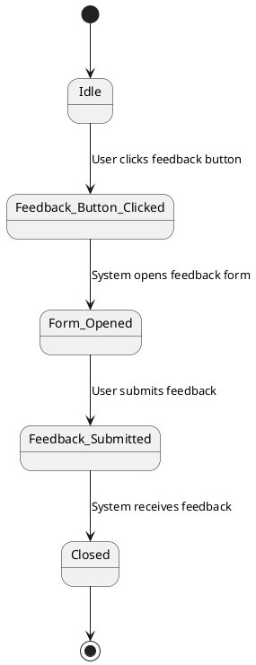
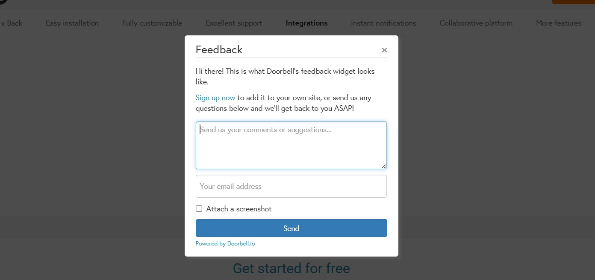

# FEA048 - Customer Feedback Integration

| | |
|:-:|:-:|
| Feature ID | FEA048 |
| Subsystem the feature is part of | Customer Feedback |
| Responsible person | Mark Chesthill |
| Status | Proposal |

### Description

 a customer feedback tool designed to help businesses collect, manage, and analyze feedback from users directly within their websites or mobile apps. Here's a breakdown of what it does and how you can benefit from it:

We have been searching several possible solutions to implement feedback mechanism:

* ZENDESK
* USER VOICE
* UseResponse
* Nolt

We have focused currently to use Doorbell.io until we can find another solution

Benefits of Doorbell

* Feedback Collection: Adds a feedback form to your website or app in under 2 minutes.
* Customizable Forms: You can tailor the feedback form to match your brand and collect the specific information you need.
* Multi-Platform Support: Works on web, iOS, and Android platforms.
* Instant Notifications: Sends feedback alerts via email or team chat apps like Slack.
* Collaboration Tools: Lets your team work together to respond to and analyze feedback.
* Integrations: Connects with over 30 services including project management and customer support tools

## Feedback Process in general

### Restrictions, requirements and use cases related to this feature

*All relevant issues related to or contributing to the definition of the feature are gathered here*

| | |
|:-:|:-:|
| [Use Case 1](./Use%20Cases/uc001.md) | |
| [Use Case 2](./Use%20Cases/uc002.md) | |
| [Security Requirement SecurityReqID]() |  |
| [AccessablityRequirement AccessReqID]() |  |

*Write preliminary user stories here*
_These should be transferred to issue descriptions as soon as possible_

* User Story 1: As a user, I want to submit feedback directly from the website or app, so that I can report bugs, suggest improvements, or share my experience easily.
* User Story 2: As a product manager, I want to receive instant notifications when new feedback is submitted, so that I can quickly review and prioritize user concerns
* User Story 3: As a designer, I want to customize the look and fields of the feedback form, so that it matches our brand and collects the most relevant information.
* User Story 4: As a business analyst, I want to categorize and analyze feedback over time, so that I can identify recurring issues and opportunities for improvement
* User Story 5: As a support team member, I want to comment on and assign feedback to the right team members, so that we can resolve issues efficiently and keep users informed
* User Story 6: As a developer, I want to see technical details (like browser, OS, and screenshots) with the feedback, so that I can reproduce and fix bugs more effectively.

**Already registered User Storys**

#174, #175, #176, #177, #178

### User interface mock-up 

*Add a picture or a link here. The mock-up should be essentially related to the feature/functionality*

This picture is just a example. Replase with possible MOCKUP!

### Proposals for Test cases / acceptance criterias

*Write down some notions for testing*

**Functional Test Cases**

* Verify that the feedback button is visible on all intended pages.
* Verify that clicking the feedback button opens the feedback form.
* Verify that the feedback form accepts input in all required fields (e.g., message, email).
* Verify that feedback can be submitted successfully.
* Verify that a confirmation message is shown after submission.
* Verify that feedback is received in the admin dashboard or integrated tool (e.g., Slack, email).
* Verify that file attachments (e.g., screenshots) can be uploaded and received.
* Verify that the form works on both desktop and mobile devices.

**Security Test Cases**

* Verify that the feedback form is protected against XSS and injection attacks.
* Verify that file uploads are scanned and restricted to allowed types.
* Verify that user data is transmitted securely (e.g., via HTTPS).

**Usability Test Cases**

* Verify that the feedback form is accessible (keyboard navigation, screen reader support).
* Verify that the form layout is responsive and user-friendly.
* Verify that error messages are clear and helpful when required fields are missing.

**Integration Test Cases**

* Verify that feedback is correctly pushed to third-party tools (e.g., Jira, Trello, Slack).
* Verify that metadata (browser, OS, URL) is included with the feedback.
* Verify that feedback is categorized/tagged correctly if applicable.

**Analytics & Reporting Test Cases**

* Verify that feedback entries are logged and timestamped.
* Verify that feedback can be filtered and searched in the admin panel.
* Verify that feedback trends can be exported or visualized.

