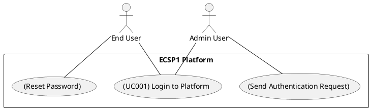

# Use Case: UC001 - Login to Platform

* Author: Tugba Ilhan
* Date / Version: 09/06/2025 - v1.0
	
**User roles**	

| Role | Description |
|:-|:-:|
| End User | A customer who wants to log in to shop |
| Business Owner | A merchant who wants to manage the store |
| Platform Admin | Admin with elevated access rights |

**Prerequisites / Conditions**	

- The user has already registered an account.

- The platform is online and accessible.

- User knows their login credentials (email/username + password).

- Optional: 2FA is enabled if configured.

**Use Case Diagram**

**Description of use case -Login to Platform**

1. User navigates to the login page.

2. User enters email/username and password.

3. Platform validates credentials.

4. If valid, session is created and user is redirected to their dashboard.

5. If 2FA is enabled, user is prompted for second-factor authentication.

6. User completes login process and accesses account.

**Exceptions**
 
| ID | Description |
|:-|:-:|
| E1 | User enters incorrect credentials → Show error message. |
| E2 | Account is locked after multiple failed attempts → Delay login. |
| E3 | Server is down → Show maintenance page or retry option. |	
	
**Result**	

* User gains access to their personalized dashboard with correct permissions according to role.

**Use frequency** 

* High: Executed by nearly all users on a daily basis.

**Additional information**	

* Integration with Gmail and social logins planned.

* 2FA support to be extended using Google Authenticator.

* Use of encrypted password storage (bcrypt).

* Relevant API endpoint: POST /api/auth/login

**Sources**

This user story follows public administration specification documentation format.
Thanks to original contributors and reference documents from the Finnish ICT Recommendations for digital services.

[Back to Use Cases Index...](../requirement-specification.md?ref_type=heads#some-selected-use-cases-as-a-table)
