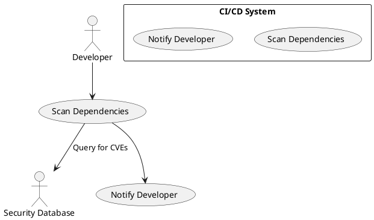

# Use Case : UC14 – Monitor Security of Dependencies

* Author: Tugba Ilhan
* Date / Version: 09/07/2025 - v0.1
	
**User roles**	

| Role | Description |
|:-|:-:|
| Developer | The person responsible for managing dependencies and fixing security issues |
| CI/CD System | Continuously scans and notifies about vulnerabilities |
| Security Database | External databases such as NVD, Snyk, or GitHub Advisory |
| Project Manager | Gets notified for high-risk issues and ensures follow-up |

**Prerequisites / Conditions**	

- The project uses software dependencies (e.g., npm, pip, composer, etc.).

- A CI/CD system or security monitoring tool is already configured.

- A vulnerability scanning integration is in place (e.g., GitLab).

- The developer has permission to update dependencies. 

**Use Case Diagram**

**Description of use case – Make Payment**

1. The CI/CD system or security scanner periodically checks project dependencies.

2. Dependencies are cross-checked with public security databases such as GitHub.

3. If a critical vulnerability (CVSS score ≥ 7.0) is found, a notification is sent to the developer.

4. The alert includes key details such as the package name, version, CVE ID, and severity.

5. The developer updates or replaces the vulnerable package.

6. CI/CD pipeline re-runs automated tests, and once validated, changes are merged.

7. If necessary, the Project Manager is informed for visibility and tracking.

**Exceptions**
 
| ID | Description |
|:-|:-:|
| E1 | Security database unreachable → Retry in the next scan cycle |
| E2 | Developer fails to receive alert → Check e-mail/GitLab/notification settings |
| E3 | Dependency update causes breakage → Lock version, escalate for resolution |	
| E4 | False positive → Review with security team and whitelist if justified |	
	
**Result**	

The developer is promptly informed about high-risk security issues in dependencies and can mitigate them quickly to reduce exposure.

**Use frequency** 

Medium to High – Triggered regularly by scheduled scans or on each merge into main branches.

**Additional information**	

* Recommended tools: Snyk, Trivy, GitHub Dependabot, npm audit, Composer Audit

* Notification channels: Email, Slack, GitLab MR/issue comment

* Critical threshold: CVSS ≥ 7.0

* No release should proceed with unresolved critical vulnerabilities.

* Exceptions must be documented and approved if added.

* Projects should lock dependency versions using composer.lock, package-lock.json, etc.

**Sources**

This use case aligns with OWASP Dependency-Check guidelines and follows secure development best practices documented by GitLab, and GitHub.

[Back to Use Cases Index...](../requirement-specification.md?ref_type=heads#some-selected-use-cases-as-a-table)
