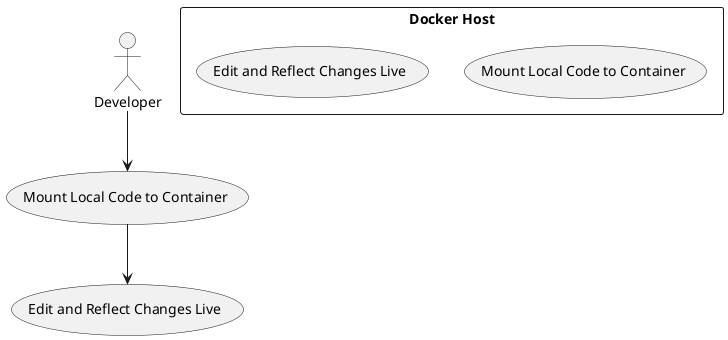

# Use Case : UC15 – Mount Local Code in Docker for Live Development

* Author: Tugba Ilhan
* Date / Version: 10/07/2025 - v0.1
	
**User roles**	

| Role | Description |
|:-|:-:|
| Developer | Writes and modifies PrestaShop code locally |
| Docker Runtime | Runs the containerized environment |
| Host Operating System | Provides access to local file system |
| CI/CD System (Optional) | May reuse mounted code for pipeline tasks (optional) |

**Prerequisites / Conditions**	

- Developer has a local PrestaShop project on their machine

- Docker is installed and running

- Docker Compose or a custom Dockerfile is available

- Proper volumes configuration is defined in docker-compose.yml or docker run

- File permissions allow Docker to read/write mapped folders 

**Use Case Diagram**

**Description of use case – Make Payment**

1. The developer sets up a Docker container for PrestaShop development.

2. Local project directory is mounted into the container using volume mapping (e.g., volumes: ./prestashop:/var/www/html).

3. Developer edits files using their local IDE or editor.

4. Changes are instantly reflected inside the container’s web server (Apache/Nginx).

5. Developer reloads the browser to verify the updates.

6. Optionally, changes can be committed and tested in CI/CD pipelines.

**Exceptions**
 
| ID | Description |
|:-|:-:|
| E1 | Volume mount not working → Check Docker version and permissions |
| E2 | File permission issues → Ensure correct user/group mapping inside container |
| E3 | Web server not auto-reloading → Restart container or use tools like nodemon, browser-sync, or PHP reload modules |	
| E4 | Mounting large folders slows down Docker (especially on Windows/macOS) → Optimize sync or use docker-sync |	
	
**Result**	

Developer can edit code locally and see changes reflected live in the Docker container, significantly accelerating the development-feedback cycle.

**Use frequency** 

High – Used daily during active development of PrestaShop modules or themes.

**Additional information**	

* Volume mapping example:

volumes:
  - ./prestashop:/var/www/html

* Recommended tools:

    - Docker Compose

    - VS Code Remote Containers

    - Mutagen or docker-sync (for better performance on macOS)

* Common paths:

    - /var/www/html (PrestaShop root in container)

    - ./modules, ./themes (specific local folders to mount)

* Ensure .gitignore does not ignore mounted files unintentionally

**Sources**

This use case follows Docker’s official best practices and recommendations from PrestaShop’s developer documentation and the open-source PHP container community.

[Back to Use Cases Index...](../requirement-specification.md?ref_type=heads#some-selected-use-cases-as-a-table)
