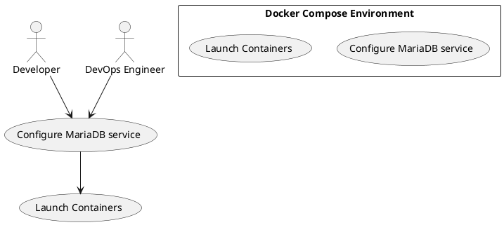

# Use Case : UC16 – Configure MariaDB in Docker Compose for PrestaShop

* Author: Tugba Ilhan
* Date / Version: 10/07/2025 - v0.1
	
**User roles**	

| Role | Description |
|:-|:-:|
| Developer | PrestaShop developer who configures and uses MariaDB in Docker for local development |
| DevOps Engineer | Maintains and supports Docker Compose setups and database integrations |
| CI/CD System | Automates testing and deployment with the configured MariaDB service |
| Project Manager | Oversees development progress and environment consistency |

**Prerequisites / Conditions**	

- Docker and Docker Compose are installed and properly configured on the developer’s machine.

- A PrestaShop Docker development environment is available or planned.

- MariaDB Docker image is accessible (public or private registry).

- Developer has permissions to modify Docker Compose files and PrestaShop configurations.

**Use Case Diagram**

**Description of use case – Make Payment**

1. Developer adds MariaDB service configuration to the Docker Compose file, specifying image version, environment variables (root password, database name, user credentials), and volume mounts for persistence.

2. Developer launches the Docker Compose environment, pulling MariaDB image if not already present.

3. MariaDB container starts and initializes the database as configured.

4. Developer configures PrestaShop to connect to MariaDB using the container’s network settings.

5. Developer tests database connectivity and verifies that PrestaShop functions correctly using MariaDB.

6. If any issues arise (connection errors, permission issues), developer troubleshoots and adjusts configuration.

7. Once verified, the environment setup is documented for team usage and CI/CD integration.

**Exceptions**
 
| ID | Description |
|:-|:-:|
| E1 | MariaDB image unavailable or pull fails → Retry or use alternative image/version |
| E2 | Connection between PrestaShop and MariaDB fails → Check network settings, credentials |
| E3 | Data persistence issues → Verify volume mounts and permissions |	
| E4 | Configuration conflicts in Docker Compose → Validate YAML and environment variables |	
	
**Result**	

The developer has a fully functional MariaDB service running inside Docker Compose, integrated with PrestaShop local development environment, enabling consistent and efficient development and testing.

**Use frequency** 

High – This setup is used regularly during local development and testing phases, as well as in CI/CD pipelines.

**Additional information**	

* Recommended MariaDB Docker image version aligned with PrestaShop compatibility.

* Use of persistent volume mounts to retain database data across container restarts.

* Docker Compose file should be version-controlled and shared across the development team.

* Possible integration with automated database migration tools for schema updates.

**Sources**

- [MariaDB official Docker image documentation.](https://hub.docker.com/_/mariadb)

- [Docker Compose documentation.](https://docs.docker.com/compose/)

- PrestaShop development best practices.

[Back to Use Cases Index...](../requirement-specification.md?ref_type=heads#some-selected-use-cases-as-a-table)
