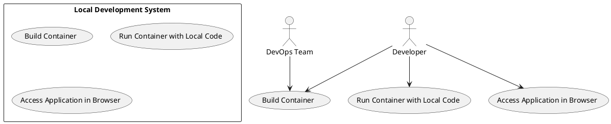

# Use Case : UC17 – Use Containers for Local Development

* Author: Tugba Ilhan
* Date / Version: 11/07/2025 - v0.1
	
**User roles**	

| Role | Description |
|:-|:-:|
| Developer | Uses containerized environments to build, test, and run the application |
| DevOps Team | Provides base container images, ensures compatibility and documentation |
| CI/CD System | Optionally runs the same containers in automated pipelines |

**Prerequisites / Conditions**	

- Docker is installed on the developer’s local machine.

- Source code is compatible with containerized environments (e.g., PrestaShop, Laravel, etc.).

- Required Dockerfile and/or docker-compose.yml is available in the repository.

- Developer has necessary permissions to run and mount local volumes.

**Use Case Diagram**

**Description of use case – Make Payment**

1. Developer pulls the latest version of the repository that includes a Dockerfile or docker-compose.yml.

2. Developer runs the container using docker-compose up or docker build + docker run.

3. The container starts with predefined services such as PHP, MariaDB, and Apache/Nginx.

4. Developer mounts their local codebase into the container using volume mounts.

5. As code changes are made locally, they are reflected in the running application.

6. Developer can access the app through a browser (e.g., http://localhost:8080).

7. Logs and errors can be monitored through the Docker CLI or integrated tools.

8. DevOps team may occasionally update base images or documentation. 

**Exceptions**
 
| ID | Description |
|:-|:-:|
| E1 | Docker is not installed → Provide installation guidance |
| E2 | Container build fails due to missing dependency → Update Dockerfile |
| E3 | Local code changes are not reflected → Check volume mount syntax |	
| E4 | Port conflicts (e.g., 80, 3306) → Allow port customization in .env or yml file |	
| E5 | Application fails to start → Check logs inside container |	

**Result**	

Developer can build and test the application inside a container with all dependencies pre-configured, allowing consistent and isolated local development across all team members.

**Use frequency** 

High – used daily by developers during development and testing phases.

**Additional information**	

* Tools: Docker, Docker Compose, DevContainers (VSCode), Portainer

* Sample commands:

    - docker-compose up --build

    - docker build -t prestashop-dev . && docker run -v $(pwd):/var/www/html prestashop-dev

* Makefile or script helpers can be added for easier usage

* Container should replicate staging/production setup as closely as possible

* Update README.md with usage instructions

**Sources**

- [Docker Best Practices for Developers](https://docs.docker.com/build/building/best-practices/)
- [PrestaShop Official Docker Image](https://github.com/PrestaShop/docker)

[Back to Use Cases Index...](../requirement-specification.md?ref_type=heads#some-selected-use-cases-as-a-table)
