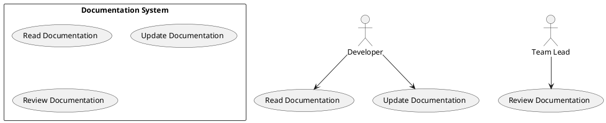

# Use Case : UC18 – Use and Maintain Developer Documentation

* Author: Tugba Ilhan
* Date / Version: 14/07/2025 - v0.1
	
**User roles**	

| Role | Description |
|:-|:-:|
| Developer | Uses and contributes to the documentation to perform tasks. |
| Team Lead | Reviews and ensures the documentation is accurate and updated. |
| New Contributor | Relies on documentation to understand and join development. |
| Technical Writer (optional) | Maintains structure, formatting, and clarity of docs. |

**Prerequisites / Conditions**	

- The project exists and has a working codebase.

- There is a platform or folder for documentation (e.g., GitLab Wiki, /docs folder).

- Basic documentation already exists or needs to be created.

- Developers have access and permission to edit the docs.

**Use Case Diagram**

**Description of use case – Make Payment**

1. Developer accesses the documentation to understand setup, tools, or conventions.

2. If the documentation is outdated or unclear, the developer proposes or directly makes updates.

3. Team Lead or peer developer reviews the changes (via MR or Wiki history).

4. Documentation is version-controlled and kept aligned with project changes.

5. A new developer uses the docs to set up the project and gives feedback.

**Exceptions**
 
| ID | Description |
|:-|:-:|
| E1 | Developer cannot find relevant docs → Raise an issue or contact Team Lead |
| E2 | Docs are outdated → Developer updates and submits for review |
| E3 | New contributor is blocked by unclear steps → Logs issues/improvement notes |	
| E4 | Merge request with doc update fails review → Sent back for revision |	

**Result**	

Documentation remains up-to-date and usable, enabling efficient onboarding and reducing developer dependency on verbal explanations or guesswork.

**Use frequency** 

High – Documentation is consulted and updated regularly during development, onboarding, and feature work.

**Additional information**	

* Formats used: Markdown (.md), Wiki (e.g., GitLab/GitHub), /docs folder.

* Tools: MkDocs, Docusaurus, GitLab Wiki, ReadTheDocs (optional).

* Style guide: Keep titles consistent, add code snippets, keep language concise.

* Encourage the rule: "If you learn it, document it."

**Sources**

- GitLab Documentation Best Practices
- [Open Source Guide](https://opensource.guide/best-practices/)
- Internal Developer Onboarding Checklists

[Back to Use Cases Index...](../requirement-specification.md?ref_type=heads#some-selected-use-cases-as-a-table)
