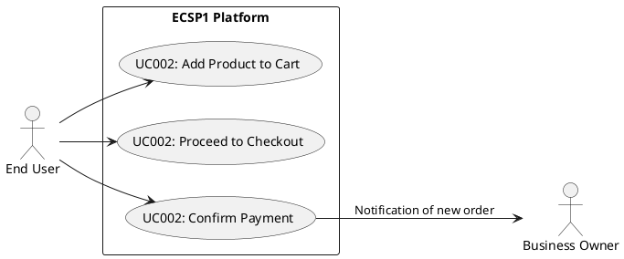

# Use Case: UC2 - Place Order

* Author: Tugba Ilhan
* Date / Version: 09/06/2025 -v0.1
	
**User roles**	

| Role | Description |
|:-|:-:|
| End User | 	A customer who wants to buy a product |
| Business Owner | Store owner who receives the order |
| Platform Admin | Oversees transactions and ensures system stability |

**Prerequisites / Conditions**	

- User must be logged into the platform.

- Product is in stock.

- Shopping cart contains at least one product.

- Shipping and billing information is complete.

- A supported payment method is available.

**Use Case Diagram**

**Description of use case -Place Order**

1. User adds product(s) to the shopping cart.

2. User proceeds to checkout.

3. User reviews order summary (items, quantity, price).

4. User provides/selects shipping and billing information.

5. User selects a payment method and confirms the order.

6. System processes payment via the selected gateway.

7. Upon successful payment, the order is created and confirmation is shown.

8. User receives confirmation email and order ID.

**Exceptions**
 
| ID | Description |
|:-|:-:|
| E1 | Payment fails (e.g., insufficient funds) → Show error and retry option |
| E2 | Item is out of stock → Inform user and update cart |
| E3 | Network error during checkout → Prompt user to try again |
	
	
**Result**	

* A new order is successfully created and saved.

* The business owner is notified.

* Inventory is updated.

* User receives order summary and tracking information.

**Use frequency** 

Medium to High: Depending on traffic, it can be executed thousands of times daily.

**Additional information**	

* Integration with Stripe, PayPal, and local gateways supported.

* Order ID format: ECSP1-YYYYMMDD-xxxxx

* Business Owner can track orders via admin panel.

**Sources**

This documentation follows common use case modeling practices for eCommerce platforms.

[Back to Use Cases Index...](../requirement-specification.md?ref_type=heads#some-selected-use-cases-as-a-table)

