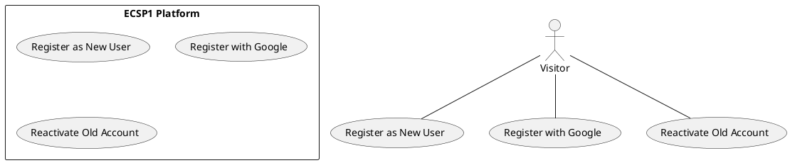

# Use Case : UC3 - User Registration

* Author: Tugba Ilhan
* Date / Version: 09/06/2025 - v0.1
	
**User roles**	

| Role | Description |
|:-|:-:|
| Visitor | A person who wants to create a new account |
| Platform System | Validates user input and manages registration logic |
| Platform Admin | Can view user registrations or handle edge cases |

**Prerequisites / Conditions**	

- User has not registered previously.

- Platform is operational and registration module is enabled.

- User has access to a valid email address.

- Optional: CAPTCHA/reCAPTCHA is active to prevent bot abuse.

**Use Case Diagram**

**Description of use case -User Registration**

1. Visitor navigates to the registration page.

2. User enters required information (name, email, password).

3. User agrees to the terms and privacy policy.

4. Optionally selects Google social login.

5. Form is submitted and validated by the platform.

6. Confirmation email is sent; account is activated upon verification.

**Exceptions**
 
| ID | Description |
|:-|:-:|
| E1 | Email already in use → Prompt to login or reset password |
| E2 | Invalid field values (e.g., weak password) → Show validation errors |
| E3 | Email confirmation fails or not received → Option to resend confirmation email |	
	
**Result**	

User successfully registers and gains access to their dashboard after confirming their email.

**Use frequency** 

Moderate to high: Especially frequent during campaigns, promotions, and new user onboarding periods.

**Additional information**	

* Future integration with Apple ID login planned.

* Password hashing handled using bcrypt or Argon2.

* GDPR-compliant consent required during registration.

* Related API endpoint: POST /api/auth/register

**Sources**

This user story follows public administration specification documentation format.
Thanks to original contributors and Finnish JHS ICT recommendations.

[Back to Use Cases Index...](../requirement-specification.md?ref_type=heads#some-selected-use-cases-as-a-table)

