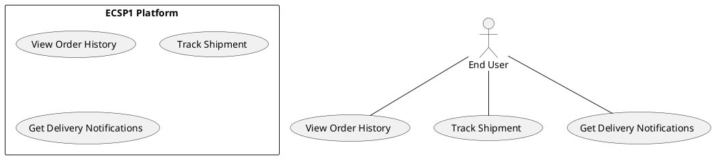

# Use Case : UC4 - Track Shipment

* Author: Tugba Ilhan
* Date / Version: 09/06/2025 - v0.1
	
**User roles**	

| Role | Description |
|:-|:-:|
| End User | A customer who wants to monitor the delivery progress of an order |
| Platform System | Retrieves shipment tracking data and displays it to the user |
| Logistics API | External delivery service provider that shares shipment updates |

**Prerequisites / Conditions**	

- The user has placed an order that has been shipped.

- A valid tracking number is associated with the shipment.

- The logistics provider’s API is reachable and responsive.

**Use Case Diagram**

**Description of use case -Track Shipment**

1. End user logs into the platform.

2. Navigates to "My Orders" or "Order History" section.

3. Selects a specific order that has been marked as "Shipped".

4. Platform fetches the tracking number associated with the order.

5. Shipment status is retrieved from the logistics provider’s API.

6. User sees real-time tracking info and estimated delivery time.

**Exceptions**
 
| ID | Description |
|:-|:-:|
| E1 | Tracking number missing or invalid → Show error message or "Tracking not available" |
| E2 | Logistics API down or delayed → Display fallback message / retry mechanism |
| E3 | Shipment lost or status undefined → Show "Contact support" message |	
	
**Result**	

User views the current status, location, and estimated delivery date of their shipment.

**Use frequency** 

Medium: Used by most customers at least once per order cycle

**Additional information**	

* SMS/email push notification support under development.

* API integration with DHL, UPS, and local postal services.

* Mobile app notifications for real-time updates are in roadmap.

* Endpoint example: GET /api/orders/:id/tracking

**Sources**

This user story follows public administration specification documentation format.
Thanks to original contributors and the Finnish JHS ICT framework.

[Back to Use Cases Index...](../requirement-specification.md?ref_type=heads#some-selected-use-cases-as-a-table)
