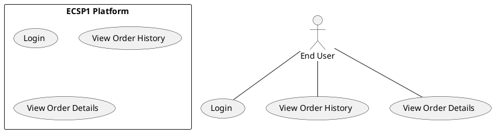

# Use Case : UC5 - View Order History

* Author: Tugba Ilhan
* Date / Version: 09/06/2025 - v0.1
	
**User roles**	

| Role | Description |
|:-|:-:|
| End User | A registered customer who wants to view their past orders |
| Platform System | Retrieves and displays order data from the backend database |
| Business Owner | (Optional) May access order history for customer service purposes |

**Prerequisites / Conditions**	

- User must be registered and logged in.

- User must have previously placed at least one order.

- Order data must be stored and retrievable from the system database.

**Use Case Diagram**

**Description of use case -View Order History**

1. User logs into the ECSP1 platform.

2. Navigates to the “My Account” or “Order History” section.

3. Platform fetches all past orders associated with the user's account.

4. Orders are displayed with basic details: order ID, date, total, status.

5. User can click on any order to view more detailed information (products, shipping, etc.).

6. User optionally filters or sorts orders by date, status, or amount.

**Exceptions**
 
| ID | Description |
|:-|:-:|
| E1 | No past orders found → Show message “You have not placed any orders yet.” |
| E2 | Database connection issue → Display “Unable to load orders, please try again.” |
| E3 | Session expired → Redirect to login page |	
	
**Result**	

User successfully views a list of their past orders with current status, and can access details if needed.

**Use frequency** 

Medium to high: Used regularly by returning customers to track or review their purchases.

**Additional information**	

* Pagination or infinite scrolling is recommended for users with many orders.

* Integration with shipment tracking and invoice download is planned.

* Optional functionality: Export order history as PDF or Excel.

* Relevant API endpoint: GET /api/users/:userId/orders

**Sources**

This user story follows public administration specification documentation format.
Thanks to the original contributors and JHS ICT framework.

[Back to Use Cases Index...](../requirement-specification.md?ref_type=heads#some-selected-use-cases-as-a-table)
