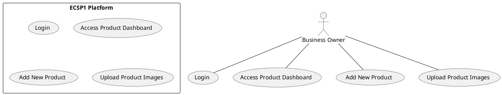

# Use Case : UC6 - Add Product to Store

* Author: Tugba Ilhan
* Date / Version: 09/06/2025 - v0.1
	
**User roles**	

| Role | Description |
|:-|:-:|
| Business Owner | A merchant who wants to add new products to their store |
| Platform System | Handles product validation, storage, and indexing in the catalog |
| Admin (optional) | Can review or moderate listings depending on configuration |

**Prerequisites / Conditions**	

- Business Owner must be registered and logged in.

- Storefront setup must be complete.

- Required product details (name, price, category, etc.) must be available.

**Use Case Diagram**

**Description of use case -Add Product to Store**

1. Business Owner logs into the ECSP1 platform.

2. Navigates to the Product Management dashboard.

3. Selects “Add New Product” option.

4. Enters product information (name, SKU, price, stock, description, category, tags, etc.).

5. Uploads one or more product images.

6. Submits the product for publishing.

7. Platform validates inputs and stores product data in database.

8. Product becomes visible in the storefront if validation passes.

**Exceptions**
 
| ID | Description |
|:-|:-:|
| E1 | Missing mandatory fields → Show error message indicating required fields |
| E2 | Invalid image format or size → Show upload error |
| E3 | Server/database error → Display retry message |	
| E4 | Store is not active → Prevent product publishing |	
	
**Result**	

Product is successfully added to the business owner's storefront and visible to customers.

**Use frequency** 

High for active sellers; used frequently when launching new products or updating catalog.

**Additional information**	

* Products can be edited or removed later via the dashboard.

* Optional features: bulk product upload via CSV/XML, AI-based image quality check.

* Product SEO tags can be automatically generated or manually added.

* Relevant API endpoint: POST /api/products.

**Sources**

This user story follows public administration specification documentation format.
Based on digital commerce documentation best practices (JHS & ISO 25010).

[Back to Use Cases Index...](../requirement-specification.md?ref_type=heads#some-selected-use-cases-as-a-table)
