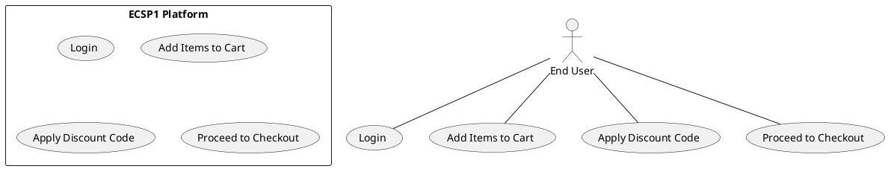

# Use Case : UC7 - Apply Discount Code

* Author: Tugba Ilhan
* Date / Version: 09/06/2025 - v0.1
	
**User roles**	

| Role | Description |
|:-|:-:|
| End User | A customer who wants to reduce total cost by applying a discount at checkout |
| Platform System | Validates discount codes and recalculates total order value |
| Admin (optional) | Can create, edit or deactivate discount campaigns |

**Prerequisites / Conditions**	

- User must have items in their cart.

- Discount code must be active and valid.

- User must be logged in (if the discount requires account-level validation).

- Cart total may need to meet a minimum threshold (if applicable by rule).

**Use Case Diagram**

**Description of use case -Apply Discount Code**

1. User logs into the ECSP1 platform.

2. Adds products to their shopping cart.

3. Navigates to the cart or checkout page.

4. Enters a discount code in the designated input field.

5. Platform checks code validity, expiration date, usage limits, and other rules.

6. If valid, discount is applied and total amount is updated.

7. If invalid, error message is shown with reason (expired, invalid, already used, etc.).

**Exceptions**
 
| ID | Description |
|:-|:-:|
| E1 | Invalid code → Show message: “Code not found or expired. |
| E2 | Minimum purchase amount not met → Show threshold message. |
| E3 | Code already used by this user → Inform user it is not reusable. |	
| E4 | System error during validation → Suggest retry or contact support. |	
	
**Result**	

Valid discount is applied successfully, total price is updated, and user can continue with checkout.

**Use frequency** 

Medium to High: Common during promotional campaigns and sales events.

**Additional information**	

* Discounts can be percentage-based or fixed-value.

* Some codes are user-specific, time-limited, or require newsletter subscription.

* Admin backend allows creation of coupon rules (validity, usage limits, exclusions).

* Relevant API endpoint: POST /api/checkout/discount/apply.

* Discounts also visible in order summary and confirmation email.

**Sources**

This use case is documented in accordance with public digital service design guidelines.
Inspired by practices in PrestaShop module development and marketing automation systems.

[Back to Use Cases Index...](../requirement-specification.md?ref_type=heads#some-selected-use-cases-as-a-table)
