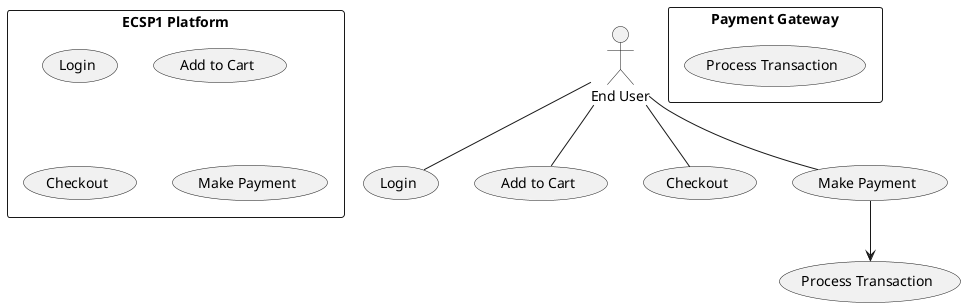

# Use Case : UC8 - Make Payment

* Author: Tugba Ilhan
* Date / Version: 09/06/2025 - v0.1
	
**User roles**	

| Role | Description |
|:-|:-:|
| End User | Customer who proceeds to pay for their order |
| Payment Gateway | External service provider (e.g., PayPal, Stripe) handling secure transactions |
| Platform System | Coordinates payment process, sends data to gateway, verifies transaction |

**Prerequisites / Conditions**	

- User has items in cart and has proceeded to checkout

- Delivery information is already provided.

- A valid payment method is selected.

- Platform is integrated with selected payment gateway(s).

**Use Case Diagram**

**Description of use case – Make Payment**

1. User logs in and adds products to the cart.

2. Proceeds to the checkout page and confirms order details.

3. Selects preferred payment method (e.g., PayPal, Stripe, credit card).

4. System redirects or communicates securely with the selected payment gateway.

5. User completes the payment process (may be redirected to external gateway page).

6. Gateway confirms transaction status and sends response back to the platform.

7. If payment is successful, order is confirmed and a confirmation message/email is sent.

8. If failed, user is shown an error message and offered retry options. 

**Exceptions**
 
| ID | Description |
|:-|:-:|
| E1 | Payment declined by gateway → Notify user, suggest checking card details or balance |
| E2 | Session timeout → Request user to start checkout again |
| E3 | Network error during transaction → Show retry option |	
| E4 | Payment gateway unreachable → Show fallback message and allow alternative method selection |	
	
**Result**	

Transaction is successfully completed and payment is recorded. Order is placed and processed.

**Use frequency** 

Very High: Critical step executed for every paid transaction.

**Additional information**	

* Payment integrations use secure protocols (e.g., HTTPS, OAuth, API tokens).

* PCI-DSS compliance ensured on gateway level.

* PrestaShop supports multiple modules like Stripe, PayPal, Klarna.

* Order status updates automatically upon payment success or failure.

* Confirmation email includes invoice and payment reference.

**Sources**

This use case is based on eCommerce best practices and standard payment integration flows used in platforms like PrestaShop. Documentation aligned with public sector guidelines.

[Back to Use Cases Index...](../requirement-specification.md?ref_type=heads#some-selected-use-cases-as-a-table)
