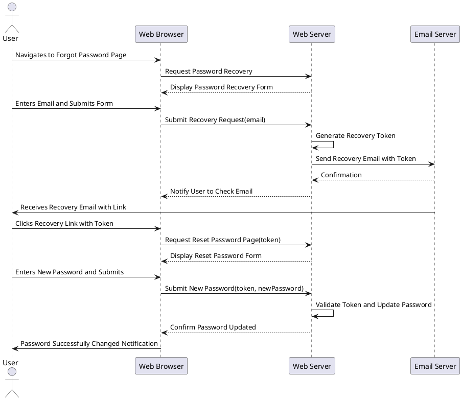

# Use Case : UC9 - Password Recovery

* Author: Joni Nisula
* Date / Version: 07/07/2025 - v0.1
	
**User roles**	

| Role | Description |
|:-|:-:|
| User | Registered user who wants to recover their account |
| Platform System | Validates user input and manages registration logic |
| Platform Admin | Can view user registrations or handle edge cases |

**Prerequisites / Conditions**	

- User has a registered account.

- Platform is operational and registration module is enabled.

- User has access to a valid email address.

- Optional: CAPTCHA/reCAPTCHA is active to prevent bot abuse.

**Use Case Diagram**

**Description of use case -User Registration**

    1. The user navigates to the password recovery page.
    2. The server sends a password recovery form to the browser.
    3. The user enters their email and submits the form.
    4. The server generates a recovery token and sends an email with a recovery link.
    5. The user receives the email and clicks the recovery link.
    6. The server validates the token and allows the user to reset their password.
    7. The user enters a new password, and the server updates the password.

**Exceptions**
 
| ID | Description |
|:-|:-|
| E1 | Email not found → Notify user that if the email exists, a recovery email has been sent |
| E2 | Invalid recovery token → Inform user the link is invalid or expired and prompt to request a new recovery email |
| E3 | Expired recovery token → Notify user the link has expired and to initiate the recovery process again |
| E4 | Password reset attempt limit exceeded → Lock the process temporarily and notify user to try again later or contact support |
| E5 | New password does not meet requirements → Display password requirements and prompt for a valid password |
| E6 | Database error → Log error and notify user of a technical issue |
| E7 | Network issues → Inform user of potential network issues and suggest checking their connection |
| E8 | Account locked → Notify user that the account is locked and provide unlock instructions or support contact |
| E9 | Email delivery failure → Notify user of email sending issue and to check email address or contact support |
| E10 | Session timeout → Redirect user to login page and prompt to restart the password recovery process |

	
**Result**	

User successfully recovers their password and regains access to their account.

**Use frequency** 

Moderate: The need for password recovery depends on the registered user count. Also some bad faith actors might try to use recovery system to
steal passwords.

[Back to Use Cases Index...](../requirement-specification.md?ref_type=heads#some-selected-use-cases-as-a-table)

