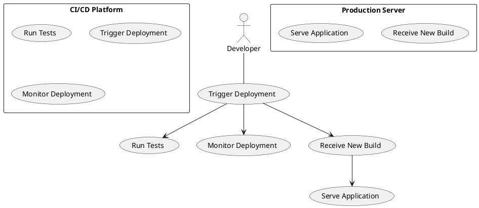

# Use Case : UC10 -  One-Click Deployment to Production

* Author: Tugba Ilhan
* Date / Version: 10/07/2025 - v0.1
	
**User roles**	

| Role | Description |
|:-|:-:|
| Developer         | Person responsible for coding and initiating deployments |
| CI/CD System      | Automation system (e.g., GitLab CI, Jenkins, GitHub Actions) that handles build and deployment |
| Production Server | Target environment where the final application is deployed |
| Platform System   | Coordinates the code integration, testing, and deployment pipeline |

**Prerequisites / Conditions**	

- CI/CD pipeline is correctly configured and functional

- Developer has merge access or push rights to release branches

- The project has passed all required tests (unit/integration)

- Secrets and environment configs for deployment are securely set

**Use Case Diagram**

**Description of use case – Make Payment**

1. Developer merges code to the production branch or clicks the "Deploy to Production" button.

2. CI/CD pipeline is triggered automatically.

3. Pipeline runs automated tests and security scans.

4. If tests pass, system builds the application and prepares it for deployment.

5. CI/CD pushes the new build to the production server.

6. Production server deploys the build and reloads the application or services as necessary.

7. Developer receives a deployment success/failure notification.

8. Deployment log and version tag are stored for traceability. 

**Exceptions**
 
| ID | Description |
|:-|:-:|
| E1 | Build failure → Deployment is aborted, error log is sent to the developer |
| E2 | Test failure → CI/CD halts, requires fix and re-run |
| E3 | Server inaccessible → Deployment fails, rollback is triggered if possible |	
| E4 | Misconfiguration → Alert generated, admin intervention required |	
	
**Result**	

Application is deployed to the production environment with one click, and status is logged. The system is immediately available with the latest version.

**Use frequency** 

Medium to High: Used at every production release, frequency depends on release cycles (daily/weekly/monthly).

**Additional information**	

* Deployment history and audit logs are retained for traceability.

* Git tags or commit hashes are linked to deployments.

* Rollback mechanism should be in place for failed deployments.

* Health checks verify application functionality after deployment.

* Deployment notifications can be integrated with Slack, email, or project dashboards.

**Sources**

This use case reflects DevOps best practices and GitLab/GitHub CI deployment patterns. Adapted for PrestaShop and modern eCommerce application workflows.

[Back to Use Cases Index...](../requirement-specification.md?ref_type=heads#some-selected-use-cases-as-a-table)
