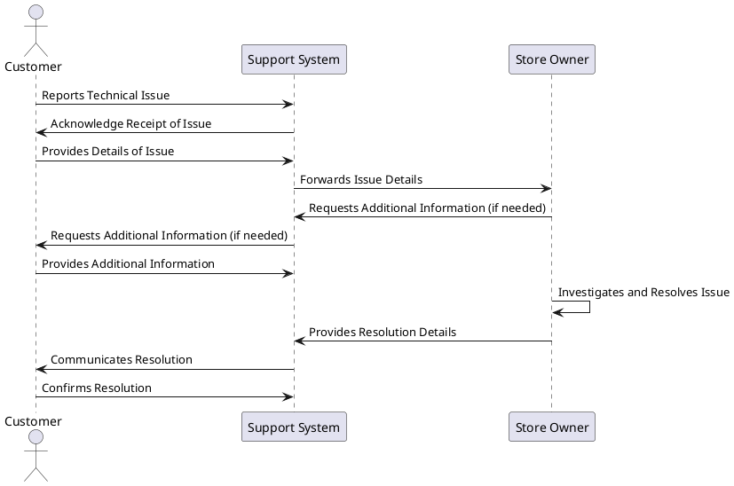

# Use Case: UC11 - Customer Support for Technical Issues

* Author: Joni Nisula
* Date / Version: 08/07/2025 - v0.1

## User Roles
   Role | Description |
 | - | - |
 | Customer | A registered user who encounters technical issues and needs support |
 | Support System | Manages and processes customer support requests |
 | Store Owner | Addresses and resolves technical issues reported by customers |

## Prerequisites / Conditions

- Customer has a registered account.
- Support system is operational and accessible.
- Customer has access to a communication channel (e.g., email, chat, support ticket system).
- Store owner is available to address and resolve issues.

## Use Case Diagram

## Description of Use Case - Customer Support for Technical Issues

    1. The customer encounters a technical issue and reports it to the support system.
    2. The support system acknowledges receipt of the issue.
    3. The customer provides details of the issue.
    4. The support system forwards the issue details to the store owner.
    5. The store owner may request additional information if needed.
    6. The support system requests additional information from the customer if needed.
    7. The customer provides the additional information.
    8. The store owner investigates and resolves the issue.
    9. The store owner provides resolution details to the support system.
    10. The support system communicates the resolution to the customer.
    11. The customer confirms the resolution.

## Exceptions
 |ID | Description |
 | - | - |
 | E1 | Issue details incomplete | Notify customer to provide complete details of the issue |
 | E2 | Store owner unavailable | Inform customer of delay and expected response time |
 | E3 | Issue cannot be replicated | Request additional details or logs from the customer |
 | E4 | Resolution time exceeds SLA | Escalate the issue and notify the customer of the delay |
 | E5 | Customer unresponsive | Follow up with the customer and attempt to resolve the issue with available information |
 | E6 | Technical issue requires third-party intervention | Inform customer and coordinate with the third party for resolution |
 | E7 | Communication channel failure | Provide alternative communication methods to the customer |
 | E8 | Issue resolved by customer | Confirm resolution with the customer and close the support ticket |
 | E9 | Issue requires extended investigation | Inform customer of the need for extended time and provide periodic updates |
 | E10 | Customer dissatisfaction with resolution | Escalate to higher support tier or management for further action |

## Result

Customer receives reliable and timely support for technical issues, minimizing downtime and maintaining a smooth online store experience.

## Use Frequency

Moderate to High: Frequency depends on the number of active customers and the complexity of the online store platform.

## Additional Information

- Implement a ticketing system to track and manage support requests efficiently.
- Provide multiple channels for support (e.g., live chat, email, phone) to cater to different customer preferences.
- Regularly update customers on the status of their support requests to ensure transparency and trust.
- Ensure store owners are well-trained and equipped to handle a wide range of technical issues.

[Back to Use Cases Index...](../requirement-specification.md?ref_type=heads#some-selected-use-cases-as-a-table)
