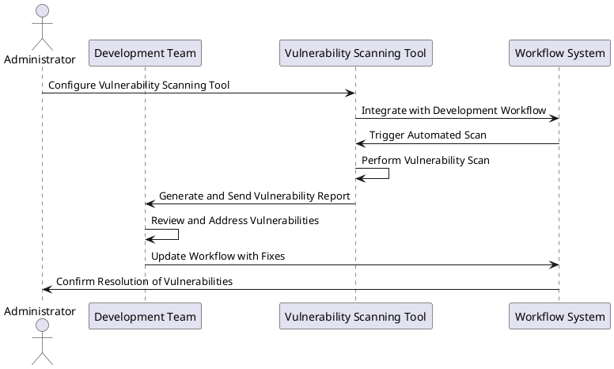

# Use Case: UC12 - Integration of Vulnerability Scanning Tool

* Author: Joni Nisula
* Date / Version: 08/07/2025 - v0.1

## User Roles
 |Role | Description |
 | - | - |
 | Development Team | Develops and maintains the product, addresses identified vulnerabilities |
 | Vulnerability Scanning Tool | Automated tool integrated into the workflow to scan and report vulnerabilities |
 | System Administrator | Manages the integration and configuration of the scanning tool within the workflow |
 | Clients | End users who benefit from the product's adherence to security best practices |

## Prerequisites / Conditions

- The vulnerability scanning tool is selected and available for integration.
- The development workflow is defined and accessible for integration.
- The team has access to the software implementation to be scanned.
- Necessary permissions and access rights are configured for the scanning tool.

## Use Case Diagram

# Description of Use Case - Implementation of Vulnerability Scanning Tool

1. The system administrator configures the vulnerability scanning tool for integration into the development workflow.
2. The vulnerability scanning tool integrates with the existing development workflow.
3. The workflow system triggers an automated vulnerability scan.
4. The scanning tool performs the scan on the software implementation.
5. The scanning tool generates a report of identified vulnerabilities and sends it to the development team.
6. The development team reviews the report and addresses the identified vulnerabilities.
7. The development team updates the workflow system with fixes and improvements.
8. The workflow system confirms the resolution of vulnerabilities to the system administrator.

## Exceptions
 |ID | Description |
 | - | - |
 | E1 | Scan tool integration failure | Notify the system administrator and attempt re-integration or troubleshoot issues |
 | E2 | Scan initiation failure | Log error and notify the system administrator to manually initiate the scan |
 | E3 | Incomplete vulnerability report | Request a rescan and notify the development team of the delay |
 | E4 | Critical vulnerabilities identified | Escalate to senior management and prioritize immediate resolution |
 | E5 | Workflow update failure | Log error, notify the system administrator, and manually update the workflow |
 | E6 | Vulnerability resolution delay | Inform the system administrator and provide an updated timeline for resolution |
 | E7 | Access rights issues | Verify permissions and access rights, and reconfigure if necessary |
 | E8 | False positives in vulnerability report | Review and verify vulnerabilities manually before addressing |
 | E9 | Tool configuration error | Reconfigure the tool settings and initiate a new scan |

## Result

The vulnerability scanning tool is successfully implemented and integrated into the workflow, providing automated vulnerability reports and ensuring that the product is developed and maintained with best security practices. This leads to greater customer satisfaction and trust in the product's security.

## Use Frequency

High: Regular vulnerability scans should be conducted as part of the continuous integration and deployment process to ensure ongoing security and compliance.

## Additional Information

- Ensure the vulnerability scanning tool is regularly updated to detect the latest security threats.
- Provide training for the development team on interpreting vulnerability reports and addressing identified issues.
- Maintain clear communication channels with clients regarding security practices and vulnerability management.

[Back to Use Cases Index...](../requirement-specification.md?ref_type=heads#some-selected-use-cases-as-a-table)