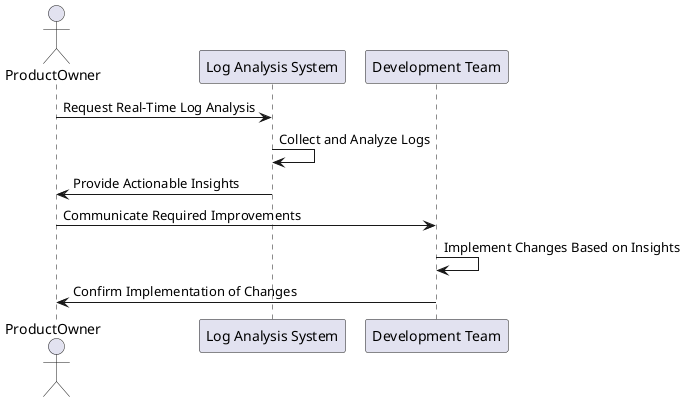

# Use Case: UC13 - Real-Time Log Analysis for Data-Driven Decisions

* Author: Joni Nisula
* Date / Version: 09/07/2025 - v0.1

## User Roles
 |Role | Description |
 | - | - |
 | Product Owner | Responsible for making strategic decisions to improve the platform based on log analysis insights |
 | Log Analysis System | Automated system that processes and analyzes logs in real-time |
 | Development Team | Implements changes and improvements based on insights derived from log analysis |
 
## Prerequisites / Conditions

- The log analysis system is operational and integrated with the platform.
- Real-time logs are accessible and configured for analysis.
- Necessary permissions and access rights are configured for the log analysis system.
- The product owner has access to the log analysis dashboard.

## Use Case Diagram

## Description of Use Case - Real-Time Log Analysis for Data-Driven Decisions

1. The product owner requests real-time log analysis from the log analysis system.
2. The log analysis system collects and analyzes logs in real-time.
3. The system provides actionable insights directly to the product owner.
4. The product owner reviews the insights and determines required improvements.
5. The product owner communicates the necessary improvements to the development team.
6. The development team implements changes based on the insights provided.
7. The development team confirms the implementation of changes to the product owner.

## Exceptions
 |ID | Description |
 | - | - |
 | E1 | Log collection failure | Notify the system administrator and attempt to resolve the issue or switch to backup logs |
 | E2 | Analysis system error | Log error and notify the product owner to use alternative analysis methods or check system status |
 | E3 | Incomplete log data | Request additional log data and notify the product owner of potential delays in insights |
 | E4 | Insights interpretation issues | Product owner reviews available data and may request additional analysis or clarification |
 | E5 | Communication failure with development team | Escalate to senior management and ensure changes are communicated through alternative channels |
 | E6 | Implementation delay | Inform the product owner and provide an updated timeline for implementation |
 | E7 | Access rights issues | Verify permissions and access rights, and reconfigure if necessary |
 | E8 | System performance degradation | Optimize log analysis processes and notify the system administrator for further investigation |

## Result

The product owner receives actionable insights from real-time log analysis, enabling data-driven decisions to improve the platform. This leads to enhanced platform performance, user satisfaction, and strategic alignment with business goals.

## Use Frequency

High: Continuous log analysis is essential for ongoing platform improvement and strategic decision-making.

## Additional Information

- Ensure the log analysis system is scalable and capable of handling large volumes of log data.
- Regularly update analysis parameters and algorithms to focus on relevant metrics and insights.
- Provide training for the product owner on interpreting log data and generating actionable insights.
- Maintain clear communication channels between the product owner and development team to ensure effective implementation of changes.

[Back to Use Cases Index...](../requirement-specification.md?ref_type=heads#some-selected-use-cases-as-a-table)