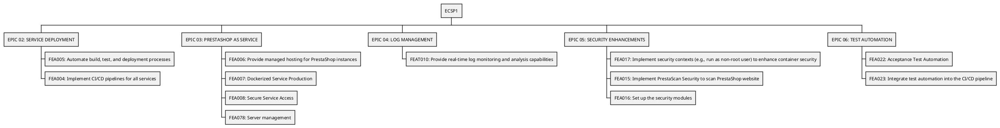

```plantuml
@startwbs
* ECSP1
** EPIC 07: BUG FIXES
*** FEA028: Ensure efficient bug reporting and triage processes
*** FEA031: Assign bugs to developers and track progress towards resolution
*** FEA030: Integrate with version control systems (e.g., Git)
** EPIC 08: REGISTRATION AND LOGIN
*** FEA035: Secure user login
*** FEA036: Password recovery
** EPIC 09: SERVICE BACKUP
*** FEA039: Automated Database Backup. Implement automated scheduling for regular database backups
*** FEA040: Implement automated backups of the entire PrestaShop installation, including files, images, and themes
** EPIC 15: DOCUMENTATION AND TRAINING
*** FEA062: General documentation
@endwbs
