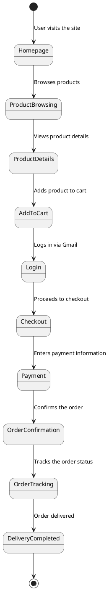

# Requirement Specification V1.0

| | |
| :-: | :-: |
| Document | Requirement Specification |
| Specification name: | Prestashop Requirement Specification  |
| Author: | Tugba Ilhan - Developer, Juha Sirnio - Tester  |
| Version: | v1.0 |
| Date: | 06.06.2025 |

<!--  -->

## Introduction

This project involves the planning, design, and development of a secure and maintainable eCommerce solution built upon the PrestaShop platform. The objective is to provide a scalable, modular, and easily deployable online store environment enriched with security, automation, monitoring, and user management features.

This project is part of a course project in secure web services, and all sensitive or personal information related to organizations, users, or clients is either anonymized or replaced with fictional equivalents.

## Primary stakeholders 

The primary stakeholders of the ECSP1 platform are online businesses and retailers seeking a secure, scalable, and easy-to-manage eCommerce solution. These are typically:

- Small to medium-sized enterprises (SMEs)

- Entrepreneurs launching new online stores

- Companies requiring reliable order processing and secure transactions

- Businesses aiming to establish or enhance their digital sales presence

They need a platform that supports custom storefronts, reliable performance, and robust security to serve their customers confidently.

## Short description of service/solution

ECSP1 is a **robust and scalable** eCommerce platform built on **PrestaShop** to empower businesses in the digital marketplace. The solution offers:

- **Customizable Storefronts** – Fully brandable and theme-adjustable design.
- **Secure Transactions** – Enhanced security with authentication, encryption, and data protection.
- **Efficient Order Management** – Smooth workflows for inventory, orders, and customer management.
- **Scalability** – Suitable for businesses ranging from startups to high-volume retailers.
- **Developer-Friendly Architecture** – Containerized, CI/CD enabled, API-accessible platform.

### Target Users
The platform is designed for a diverse user base:

- **End Users** – Customers purchasing goods via the online stores
- **Business Owners** – Individuals or companies managing their own online shops
- **Entrepreneurs** – Users launching their first eCommerce ventures
- **SMBs** – Small and medium-sized businesses transitioning to digital
- **Enterprises** – Larger organizations requiring multi-store or high-traffic support

### General Stakeholders

- **Investor** - Financial backers expecting platform stability and growth
- **Business Owners** – Users who manage and operate online stores on the platform
- **Development Team** - Responsible for platform implementation, security, and maintenance
- **Integration Service Providers** – Offering payment gateways, shipping APIs, analytics, etc.
- **Security Auditors** – Ensuring compliance and risk mitigation
- **End Users** – Final consumers who use the platform for purchasing

## Business Requirements / Needs

The platform must meet several business requirements to ensure success:

| **ReqID** | **Description** | **Rationale** |
|:-:|:-:|:-:|
| BUSINESS-REQ-01 | Implement user-friendly interface. Design a intuitive and seamless registration and login process that minimizes friction for users | A user-friendly interface enhances the overall user experience, making it easier for users to interact with the system. An intuitive registration and login process reduces barriers to entry, encouraging more users to sign up and use the platform.|
| BUSINESS-REQ-10 | Minimize the risk of data breaches and unauthorized access to sensitive information  | Protecting sensitive information is crucial for maintaining user trust and complying with data protection regulations. Minimizing the risk of data breaches helps prevent financial losses, legal issues, and damage to the company's reputation. |                 
| BUSINESS-REQ-11 | Maintain a secure and reliable operating environment for all users| A secure and reliable operating environment ensures that users can access the system without interruptions or security concerns. This stability is essential for user satisfaction and retention.|
| BUSINESS-REQ-12 | Improve user trust and confidence in the system's security | Building user trust and confidence in the system's security measures encourages users to engage more with the platform and share sensitive information, knowing it is protected. |
| BUSINESS-REQ-31 | Ensure the reliability and availability of customer PrestaShop instances with minimal downtime |  High reliability and availability of PrestaShop instances are critical for business continuity and customer satisfaction. Minimizing downtime ensures that customers can consistently access their online stores, leading to better sales and user experience. |                             
| BUSINESS-REQ-33 | Enable seamless integration of PrestaShop instances with other business applications and services | Seamless integration with other business applications and services enhances the functionality and efficiency of PrestaShop instances. It allows businesses to streamline operations, improve data flow, and provide a more comprehensive service to their customers. |                           
| BUSINESS-REQ-61 | Ensure comprehensive testing of all user interfaces (frontend and backend) |  Comprehensive testing of user interfaces helps identify and fix issues before they affect users. This ensures a smooth and error-free experience, which is crucial for user satisfaction and system reliability. |                    
| BUSINESS-REQ-62 | Provide developers with a Docker-based development environment that allows for easy setup, consistent configuration, and fast local code changes. This includes support for volume mounting, live reload capabilities, and pre-configured containers that mirror the production environment. | A Dockerized development setup simplifies onboarding, reduces environment-related bugs, and ensures that all team members work in a consistent environment. By enabling local code mounting and live feedback, developers can iterate faster and improve productivity, while reducing time lost on environment configuration and rebuilds. |                    
| BUSINESS-REQ-63 | Integrate testing into the continuous integration/continuous delivery (CI/CD) pipeline  |  Integrating testing into the CI/CD pipeline allows for automated and continuous testing of the system. This helps catch issues early in the development process, reducing the time and cost of fixing bugs and ensuring a higher quality product. |      
| BUSINESS-REQ-64 | Generate clear and concise test reports with detailed results and metrics |  Clear and concise test reports provide valuable insights into the system's performance and quality. Detailed results and metrics help stakeholders make informed decisions and prioritize improvements. |                    
| BUSINESS-REQ-65 | Implement automated vulnerability detection and alerting for third-party dependencies |  The system must continuously monitor third-party dependencies (e.g., libraries, frameworks, packages) for critical security vulnerabilities using an automated tool (e.g., GitLab Dependency Scanning, Snyk, etc.). Upon detection of a vulnerability, the system must notify the responsible developer or team with details such as severity, affected components, and suggested remediation steps. |                    
| BUSINESS-REQ-72 | Implement a secure and user-friendly account recovery mechanism (e.g., password reset via email with token-based validation) to allow users to regain access in case of forgotten credentials or account lockout. | Account recovery is a critical feature for maintaining user access continuity and satisfaction. A secure process protects against unauthorized access, while a smooth experience reduces user frustration and support requests. Ensuring secure recovery also helps maintain platform integrity and builds trust with users. |                    
| BUSINESS-REQ-74 | The system must provide developers with access to real-time debug logs during development, testing, and production troubleshooting. This includes live output of logs generated by application components, services, or containers, with structured and timestamped entries. Logs should be accessible through secure interfaces (e.g., CLI, web dashboards) and support filtering by component or severity level. | Access to real-time logging is critical for diagnosing problems, understanding application behavior, and improving development speed. Without timely and detailed logs, developers may struggle to detect root causes of issues, leading to longer downtimes and delayed deployments. Enabling secure and efficient log access aligns with DevOps best practices and supports continuous monitoring and fast feedback loops during agile development cycles. |                    
| BUSINESS-REQ-99 | Implement a fast, automated, and reliable deployment process to the production environment using CI/CD tools. The deployment workflow should support one-click releases, visibility into deployment status, and rollback mechanisms in case of failure. |  Fast and reliable production deployments are essential for reducing time-to-market, increasing development efficiency, and minimizing downtime. Automation reduces human error, while clear feedback and rollback capabilities ensure system stability and developer confidence. This enables rapid delivery of new features, bug fixes, and improvements without compromising quality. |                    


## Stakeholder Profiles 


| **ID**| Stakeholder/Profile | Description | Motivation/Rationale |
|:-:|:-:|:-:|:-:|
| STAKEHOLDER-PROF1 | [Business Owners](./Stakeholder%20Profiles/stakeholder_business_owner.md) | Person who would like to use eCommerce platform for business | Profit |
| STAKEHOLDER-PROF2 | [Product Owner](./Stakeholder%20Profiles/stakeholder_product_owner.md) | Key decision-maker in the product vision | Ensures project aligns with business goals |
| STAKEHOLDER-PROF3 | [Investors](./Stakeholder%20Profiles/stakeholder_investors.md) | Financial backers who provide funding | Potential for financial returns |
| STAKEHOLDER-PROF4 | [End Users](./Stakeholder%20Profiles/stakeholder_end_users.md) | Consumers who interact with the platform to purchase products or services | End Users are motivated by a seamless, efficient, and enjoyable experience that meets their needs and expectations while providing value |
| STAKEHOLDER-PROF6 | [Development Team](./Stakeholder%20Profiles/stakeholder_development_team.md) | Responsible for implementing, maintaining, and securing the platform, ensuring it meets technical and functional requirements | Delivering high-quality solutions on time |


## Stakeholder map


Diagramt provides a structured overview of all the stakeholders involved in **ECSP1* as a Mind Map Form.


```plantuml
actor Business_owner
actor Investor
actor End_user
actor Suppliers
actor Company
actor Competitors_customers
actor Bully
cloud ECSP1

Business_owner -- ECSP1 : benefits
Investor -- ECSP1 : benefits
End_user -- ECSP1 : uses
Suppliers -- ECSP1 : benefits
Company -- ECSP1 : competitor
Competitors_customers -- ECSP1 : potential users
Bully -- ECSP1 : threat
```

## End User / Customer story's as background information

<!-- Understanding potential users helps design the service effectively. Customer stories provide insights into how users interact with the platform. -->

**Platform customers**

<!-- * Annukka Rosenleh (End User) ], a grandmother, wants to buy a Lego toy for her grandson. She logs onto ECSP1, browses the toy category, and selects a product. She reads customer reviews, applies a discount code, and completes the transaction using PayPal. She tracks the delivery status through the platform and receives her package on time, ensuring a satisfying shopping experience.

* Rami Nieminen [Business Owner], a small business owner, is looking for a platform to sell his handmade leather products. He signs up for ECSP1, customizes his storefront, and integrates local payment options. Within weeks, his sales increase due to the platform’s SEO optimization and secure checkout process. -->

## Customer / End User Requirements / Needs


| ReqID   |                  Description                             |
|:-:|:-:|
| CUSTOMER-REQ-0001 | As a End User, I want to use Gmail authentication for easy login. |
| CUSTOMER-REQ-0002 | As a End User, I need to track my order status in real-time.      |
| CUSTOMER-REQ-0003 | As a Business Owner, I want an intuitive dashboard to track sales and inventory. |
| CUSTOMER-REQ-0004 | As a End User, I expect secure checkout with selected payment Gateway |      |
| CUSTOMER-REQ-0005 | As a Business Owner, I need to manage product categories easily. |
| CUSTOMER-REQ-0006 | As an End User, I want to recover my password easily if I forget it. |
| CUSTOMER-REQ-0007 | As a Business Owner, I want to receive automated reports about site performance. |
| CUSTOMER-REQ-0008 | As an End User, I want to save products to a wishlist for later purchase. |
| CUSTOMER-REQ-0009 | As a Business Owner, I want to schedule regular backups to prevent data loss. |
| CUSTOMER-REQ-0010 | As an End User, I want a multilingual interface so I can use it in my language. |


## Selected Customer's Journey Paths

**Customer journey path as PlantUML Statemachine -diagram**


The following diagram represents a typical customer journey path on the ECSP1 eCommerce platform. It outlines each major step taken by an end user, starting from landing on the homepage to the final delivery of their order. The process emphasizes a seamless and secure experience, incorporating product exploration, login, checkout, and order tracking stages.



<!-- This structured requirement specification document provides a clear understanding of system functionalities, stakeholder expectations, and implementation priorities for the ECSP1 eCommerce platform. It serves as a common reference point for development, design, and business decision-making teams. -->

## Selected Use Cases of _Our Service's_ 


**End User's Use Cases**

```plantuml
left to right direction
actor "End User" as EU
actor "Admin User" as AU

package eCommerce {
usecase "Login to platform" as UC1
usecase "Register" as UC3
usecase "Place_Order" as UC2
usecase "View_Order_Status" as UC4
usecase "Select_Payment_Status" as UC5
usecase "Make_Payment" as UC6
usecase "Contact_Support" as UC7
usecase "Add_Product" as UC8
usecase "Delete_Product" as UC9
usecase "View_Product" as UC10
usecase "Process_Order" as UC11
usecase "Update_Order_Status" as UC12
usecase "Cancel_Order" as UC13
usecase "Generate_Sales_Report" as UC14
usecase "View_Analytics_Dashboard" as UC15
usecase "Export_Data" as UC16

EU -> UC1
EU -> UC2
EU -> UC3
EU -> UC4
EU -> UC5
EU -> UC6
EU -> UC7
AU -> UC8
AU -> UC9
AU -> UC10
AU -> UC11
AU -> UC12
AU -> UC13
AU -> UC14
AU -> UC15

}
```

<!--  Importance of Recording Use Cases

It is useful to record all relevant use cases in one broader Use Case description because it allows you to view the system more easily. Attention! In the larger system as a whole, there may be several hundred different use cases.

A more detailed description of the use case in the training environment is provided using a use case-specific template file. For every use case, an independent file is created. -->

## Some Selected Use Case's as a table 

| Use Case | Domain |
|:-|:-:|
| [UC1 - Login to platform](./Use%20Cases/uc001.md)                                 | User Management  |
| [UC2 - Place Order](./Use%20Cases/uc002.md)                                       | Buying process |
| [UC3 - New User Register](./Use%20Cases/uc003.md)                                 | User Management |
| [UC4 - Track Shipment](./Use%20Cases/uc004.md)                                    | Order Management |
| [UC5 - View Order History](./Use%20Cases/uc005.md)                                | Order Management |
| [UC6 - Add Product to Store](./Use%20Cases/uc006.md)                              | Product Management |
| [UC7 - Apply Discount Code](./Use%20Cases/uc007.md)                               | Checkout |
| [UC8 - Make Payment](./Use%20Cases/uc008.md)                                      | Payment Integration |
| [UC9 - Password Recovery](./Use%20Cases/uc009.md)                                 | User Account Management |
| [UC10 - One-Click Deployment to Production](./Use%20Cases/uc0010.md)              | Release Management / DevOps |
| [UC11 - Customer Support for Technical Issues](./Use%20Cases/uc011.md)            | Customer Support / Technical Support |
| [UC12 - Integration of Vulnerability Scanning Tool](./Use%20Cases/uc012.md)       | Security / DevOps |
| [UC13 - Real-Time Log Analysis for Data-Driven Decisions](./Use%20Cases/uc013.md) | Observability / DevOps |
| [UC14 - Monitor Security of Dependencies](./Use%20Cases/uc0014.md)                | System Maintenance / DevOps |
| [UC15 - Mount Local Code in Docker for Live Development](./Use%20Cases/uc0015.md) | Development Environment / DevOps |
| [UC16 - Configure MariaDB in Docker Compose for PrestaShop](./Use%20Cases/uc0016.md) | System Maintenance / DevOps |
| [UC17 - Use Containers for Local Development](./Use%20Cases/uc0017.md)            | System Maintenance / DevOps |
| [UC18 - Use and Maintain Developer Documentation](./Use%20Cases/uc0018.md)        | Developer Experience / Internal Documentation |


## Preliminary MockUp-prototype layouts for solution/service

--
<!-- When defining the necessary features and functions for the service or solution under design, it is useful to sketch out some visible elements of the service layout.
In web design, these preliminary visual concepts of the user interface layout are called "Mockups." Mockups help validate the development team's understanding of the required design between the customer and the team. They also serve as a reference to check necessary functionalities during selected use cases.
Different layouts and visual representations of the service can reveal additional requirements that should be gathered in the requirements specification. -->

## Mockup Design Example for FEA048 - Customer Feedback Integration


<!--  Select MockUp tools which you prefer and create a active Mockup for feature [FEA48 - Customer Feedback Integration](./Features/FEA048.md) and do embedd you design here below by using IFRAME add link to Mockup Design. -->

* Link to FEA48 Mockup

 [FEA048 - Customer Feedback Integration](https://www.figma.com/design/fcIUielETegUgwkebcAtpI/Untitled?node-id=0-1&m=dev&t=0WnZAb61sWnOqweG-1)


## System requirements

<!--  > Commonly System requirements are higher-level requirements on the basis of which the system as a whole is defined.
> When designing services, from a technical point of view, different requirements arise
> technologies, equipment, or physical structures of realization. When defining a software service
> it is advisable to identify purely the technical / production requirements of the system in good time and record them in the requirements specification.
> Excessive concentration on the recording of technical production / implementation requirements may not be recommended because
> during design, software / service implementation requirements may still change. A solution that was considered handy during the development phase
> may prove costly during the commercialization phase of the service.
> Open in Google Translate

> In this section, it is worth considering, for example, the following

- How is the service produced? As a SAAS / PAAS / IAAS / HOSTED service etc
- Whether to use Cloud Services as part of the solution or to utilize our own servers
- Is it the so-called A hybrid service that utilizes multiple separate services
- How must the service be available 24 / 7h 100%? So is that even possible :)?
- What kind of SLA is prepared for the service?
- How much does the production of the service cost?
- What kind of data storage / archiving needs are related to the service?

> System level requirements look at the software / service as a whole and define it based on it
> e.g., technical requirements for the execution environment, resources required to maintain the service.
> System performance environment requirements include, for example, equipment requirements for the production environment or
> system runtime requirements, which may include requirements for performance, maintenance, certifications, etc

> What kind of execution environments are then used, for example, in commercial solutions? You can explore the examples at [Stack Share] (https://stackshare.io/): -->

| RequirementsID   |             Description              |
| :-: |:-: |
| SYSTEM-HW-REQ-0002 | The main services must be at least duplicated N + 1 |
| SYSTEM-HW-REQ-0003 |    Server memory capacity> 16GB      |
| SYSTEM-HW-REQ-0004 |      Intel / AMD x64 processor       |


### Constraints and standards that affect on service design

<!-- 
> The implementation and use of different software / services is often governed by laws and regulations. The requirements required by these are usually recorded as restrictions
> and their impact often affects the implementation of the entire software / system. For this reason, they should be identified and clarified in a timely manner because of the impact
> may be quite decisive in the long run. As an example, the [EU GDPR Act] (https://en.wikipedia.org/wiki/General_Data_Protection_Regulation).
-->
| ReqId  | Description              |
|:---: |:-:|
| CONSTRAINT-REQ-S001 | The service should be located in the EU area according to GDPR requirements|
| CONSTRAINT-REQ-S002 | User data must be encrypted both in transit and at rest according to ISO/IEC 27001 standard |
| CONSTRAINT-REQ-S003 | All data processing must comply with national laws regarding accessibility and usability (e.g. WCAG) |
| CONSTRAINT-REQ-S004 | Audit logs must be stored for a minimum of 12 months for traceability purposes |


### Service primay features and functionalities

Here is link to outline some of basic features of solution/service as a form of mind-map. <!-- As a mindmap form it is useful to prepare a summary (A4 size) together with the client, which will contain the whole product in crystallization, if necessary. -->

* [Product Feature MindMap](./product-mind-map.md)

<!--  It is worth noting that some of the functional requirements are in practice essential functions, i.e. they can be "upgraded" to features.
As an example, the Online Banking service has the essential function "payment from account", which is an important feature of the service in practice. Over here
there are a number of other smaller and more specific functional requirements associated with functionality
If you are asked what the service / software can do, try to identify the most important functions!
They are quite certainly essential features. Think about what functions you can do, for example, on the online banking page? What are the most important functions you use most often? Is it worth considering at the definition stage whether all the features are necessary? You should try to group the key features first. The features can be specified by functional requirements, which are called expand the feature description. In practice, the features are larger entities that make up the entire service / software.
The Finnish word feature may be a bit misleading, because often when presenting products, the aim is to emphasize its "information security" as a feature of the product. This is not to say that this is one feature of the product software but a general "design philosophy." The product may contain features that allow it to be called secure. -->

**eg. Priorization of essential features / functions **


- P1 = Mandatory
- P3 = Required
- P5 = Nice to have

| Feature | Priority | Description | 
 |:-:|:-:|:-:|
| [FEA005](./Features/FEA005.md) | P1 | Core DevOps functionality. Automating CI/CD processes is essential for improving development speed and quality. |
| [FEA006](./Features/FEA006.md) | P5 | Enhances user experience by simplifying hosting, but not critical for core system functionality. |
| [FEA007](./Features/FEA007.md) | P3 | Important for consistent and portable development environments. Facilitates smoother transition to production. |
| [FEA008](./Features/FEA008.md) | P1 | HTTPS and password reset are essential for user security and data protection. |
| [FEA010](./Features/FEA010.md) | P3 | Valuable for operational visibility and quick debugging. Not critical, but important for system health. |
| [FEA017](./Features/FEA017.md) | P1 | Fundamental for container security. Reduces vulnerabilities and ensures best practices in production. | 


## General System Functional Requirements

<!--  What are the functional requirements? Functional requirements describe the operation required of a software / system. Functional requirements are the most easily identifiable. Avoid writing multiple claims in the same sentence! Each requirement separately.
> You can present them in a table or refer to [one] (bases / baseline requirements list.md) for a larger entity -->

| ReqID  | Description | Affected feature |
|:--:|:-----:|:-----:|
| FUNC-REQ-C0001  | System automatically builds and deploys code changes via CI/CD pipeline.    | [FEA005](./Features/FEA005.md) | 
| FUNC-REQ-C0002  | Developers can trigger automated tests after each commit.                   | [FEA005](./Features/FEA005.md) | 
| FUNC-REQ-C0003  | Users can create a PrestaShop store instance with one-click setup.          | [FEA006](./Features/FEA006.md) | 
| FUNC-REQ-C0004  | 	Hosting environment is provisioned automatically with SSL and database. | [FEA006](./Features/FEA006.md) | 
| FUNC-REQ-C0005  | 	Docker image includes all required PHP extensions for PrestaShop.       | [FEA007](./Features/FEA007.md) | 
| FUNC-REQ-C0006  | 	Developers can mount local code into Docker container.                  | [FEA007](./Features/FEA007.md) | 
| FUNC-REQ-C0007  | 	All service endpoints are accessible via HTTPS.                         | [FEA008](./Features/FEA008.md) | 
| FUNC-REQ-C0008  | 	Users can reset their password via email link.                          | [FEA008](./Features/FEA008.md) | 
| FUNC-REQ-C0009  | 	Developers can view real-time logs from a centralized dashboard.        | [FEA010](./Features/FEA010.md) | 
| FUNC-REQ-C00010 | System generates alerts based on log anomalies.                             | [FEA010](./Features/FEA010.md) | 
| FUNC-REQ-C00011 | Containers run as non-root users by default.                                | [FEA017](./Features/FEA017.md) | 
| FUNC-REQ-C00012 | Vulnerability scanner is integrated into CI/CD pipeline.                    | [FEA017](./Features/FEA017.md) | 


## General Non-Functional System Requirements

Non-functional requirements define the quality attributes of a system, focusing on how the system performs rather than what it does. These requirements ensure that the system is secure, reliable, maintainable, and user-friendly. They are essential for delivering a robust and scalable PrestaShop as a Service platform that meets both technical and user expectations.

| ReqID     |  Category   | Description |
|:-:|:-:|:-:|
| NFR-001 |	Performance     | The system must support at least 100 concurrent users per store instance without performance degradation.|
| NFR-002 | Scalability     | The platform must be able to scale horizontally to support increasing numbers of store instances.|
| NFR-003 | Availability    | The service must maintain 99.9% uptime monthly, excluding scheduled maintenance.|
| NFR-004 | Security        | All data in transit must be encrypted using HTTPS/TLS 1.2 or higher.|
| NFR-005 |	Security        | Containers must run as non-root users and follow least privilege principles.|
| NFR-006 |	Maintainability | The system must support automated deployment and rollback to reduce downtime during updates.|
| NFR-007 |	Usability       | The store setup process must be completed in under 5 minutes by a non-technical user.|
| NFR-008 | Monitoring      | Real-time logging and alerting must be available for all critical services.|
| NFR-009 |Compliance       | The system must comply with GDPR for handling user data.|


### Performance / Scalability Requirements


These requirements define how efficiently and reliably the PrestaShop as a Service platform performs under various conditions. They cover aspects such as response time, throughput, scalability, and availability to ensure the system remains responsive, stable, and cost-effective as demand grows. By meeting these criteria, the platform can deliver a seamless experience to users while maintaining operational excellence.

| ReqID     |  Requirement Category   | Description |
|:-:|:-:|:-:|
| PERF-REQ-0000 | **Response Time**          | The service should respond to requests within a specified time frame under normal load conditions < 2 s                   |
| PERF-REQ-0001 |  **Throughput**            | The gateway service should be able to handle a certain number of requests per second without degradation of performance                                  |
| PERF-REQ-0002 |  **Scalability**           | The service should be able to scale up to handle increased load, either by adding more resources (vertical scaling) or by distributing the load across multiple instances (horizontal scaling) |
| PERF-REQ-0003 | **Availability**           | The service should be available for use a certain percentage of the time, often expressed as a "five nines" (99.999%) availability requirement                  |                      
| PERF-REQ-0004 |  **Latency**               | The system should maintain an average latency of less than 200 ms for API responses under normal operating conditions.  |
| PERF-REQ-0005 |  **Startup Time**          | The service containers should start and become operational within 30 seconds.  |
| PERF-REQ-0006 |  **Resource Efficiency**   | The system should optimize CPU and memory usage to ensure cost-effective operation under varying loads.|
| PERF-REQ-0007 |  **Auto-Scaling**          | The system should automatically scale up or down based on CPU/memory thresholds or request volume. |
| PERF-REQ-0008 |  **Load Balancing**        | The system should distribute incoming traffic evenly across instances to prevent overload on any single node.  |

### Security Requirements

Security requirements define the necessary safeguards a software system must implement to protect data, ensure authorized access, and maintain system integrity. These requirements are often shaped by legal regulations and industry standards, and they help prevent unauthorized access, data breaches, and other security threats. A secure system builds trust and ensures compliance with privacy and cybersecurity expectations.

|  ReqID     | Requirement Category |         Description                             |
|:-:|:-:|:-:|
| SECURITY-REQ-0001  | **Secure Communication**     | All communication between devices and servers must be encrypted to prevent interception.           |
| SECURITY-REQ-0002  |  **Authentication**          | Firefighters must be authenticated before they can access the system to ensure that only authorized personnel have access. |
| SECURITY-REQ-0003  |  **Data Integrity**          |The system must ensure that data, such as incident reports or firefighter locations, is not tampered with.  |
| SECURITY-REQ-0004  |  **Authorization**           | Users must only have access to the data and functions necessary for their role (role-based access control).   |
| SECURITY-REQ-0005  |  **Audit Logging**           | All access and changes to sensitive data must be logged for auditing and forensic purposes.  |
| SECURITY-REQ-0006  |  **Session Management**      | User sessions must expire after a period of inactivity and require re-authentication.   |
| SECURITY-REQ-0007  |  **Data Encryption at Rest** | Sensitive data stored in the system must be encrypted to prevent unauthorized access.  |
| SECURITY-REQ-0008  | **Vulnerability Management** | The system must be regularly scanned for vulnerabilities and patched in a timely manner.  |


### Accessability Requirements

These requirements ensure that the system is perceivable, operable, understandable, and robust for users with diverse abilities. Meeting accessibility standards not only improves usability for all users but also helps ensure legal compliance and inclusivity.

| ReqID |  Requirement Category  |  Description  |
|:-:|:-:|:-:|
| ACCESSABILTY-REQ-0000 | **Keyboard Accessibility** | All functionality must be operable through a keyboard interface. |
| ACCESSABILTY-REQ-0001 | **Text Alternatives** | Provide text alternatives for any non-text content. |
| ACCESSABILTY-REQ-0002 |  **Time-based Media** | Provide alternatives for time-based media, such as captions for videos. |
| ACCESSABILTY-REQ-0003 | **Contrast Ratio** | Text and interactive elements must have a contrast ratio of at least 4.5:1 against their background. |
| ACCESSABILTY-REQ-0004 | **Resizable Text** | Users must be able to resize text up to 200% without loss of content or functionality. |
| ACCESSABILTY-REQ-0005 | **Error Identification** | Input errors must be clearly identified and described to the user in text. |

## Quality Assurance

From a quality assurance perspective, it is important to ensure that all functional and non-functional requirements are testable, traceable, and verifiable. This includes comprehensive test coverage, performance and security validation, usability checks, and robust error handling. Effective QA also involves automation, continuous integration, and clear documentation to maintain product reliability and user satisfaction.

- Link to [Master Test Plan](../50-Test-management/master-test-plan.md)

## Software architecture, placement view, database description, and integrations

The system is built on a modular, service-oriented architecture using Docker and Kubernetes for scalability and maintainability. Components are deployed across cloud environments (dev, staging, prod) with load balancing and monitoring in place. A relational database (e.g., MySQL) is used for core data, with optional NoSQL support for caching. The platform integrates securely with third-party services like payment gateways, email providers, and analytics tools.

* [Software architecture](../30-Architecture-and-design/architecture-and-design.md)

## Preliminary Release Plan for the service


* [Release Plan](../40-Release-management/release-plan.md)

The release plan defines how and when new features, updates, or fixes will be delivered to users. It includes versioning strategy, deployment schedule, release frequency (e.g., monthly, quarterly), and responsible teams.

* [Release Note Template](../40-Release-management/release-note-v0.md)


<!--  
A standardized format for documenting each release. It typically includes:

- Version Number
- Release Date
- New Features
- Bug Fixes
- Improvements
- Known Issues
- Notes for Users or Developers
--> 


## Standards and sources

<!--  
> As part of the requirements definition, it is essential to identify important sources that are useful or relevant to the whole. Standards and pre-distributed guidelines are useful sources and as needed
> clarify the meaning of the requirements.
-->

1. **General Data Protection Regulation (GDPR)**: This regulation protects privacy and gives individuals control over their personal data.
2. **ePrivacy Directive**: This directive complements the GDPR and provides rules on confidentiality of communications and tracking technologies such as cookies.
3. **Directive on the legal protection of computer programs ('Software Directive')**: This directive protects computer programs by means of copyright.
4. **Directive on the enforcement of intellectual property right ('IPRED')**: This directive enforces intellectual property rights.
5. **Directive on the legal protection of databases ('Database Directive')**: This directive protects databases.
6. **EU Cybersecurity Act**: This act ensures safer hardware and software.
7. **Digital contract rules**: These rules make it easier for consumers and businesses to buy and sell digital content, digital services, goods, and 'smart goods' in the EU.

Please note that these are just a few examples and the specific laws and rules may vary depending on the context and the specific needs of your software service. It's always a good idea to consult with a legal expert to ensure compliance with all relevant laws and regulations.
