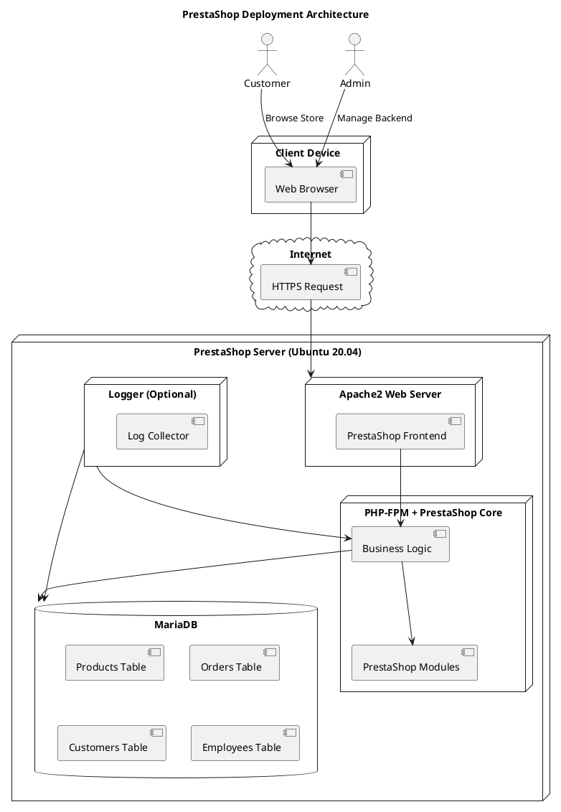
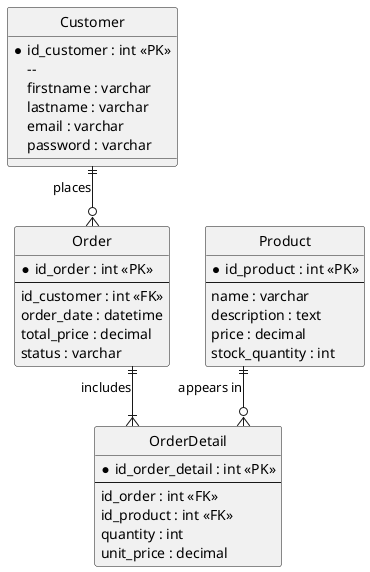
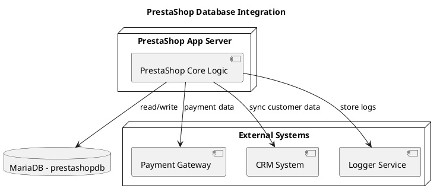
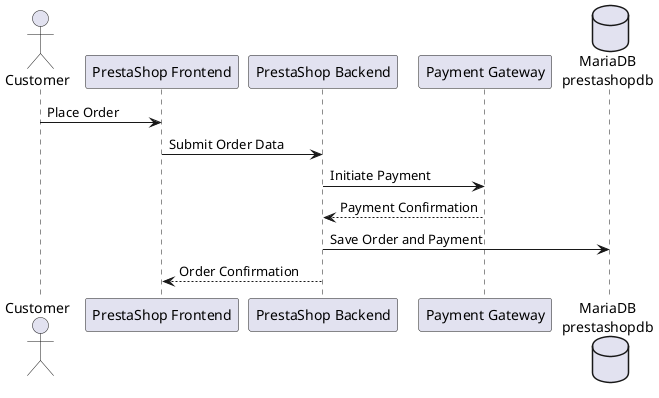
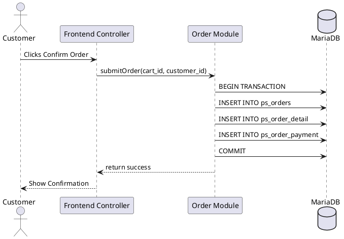
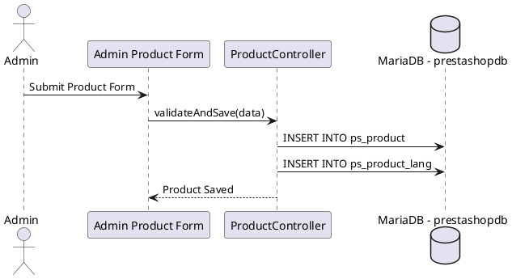
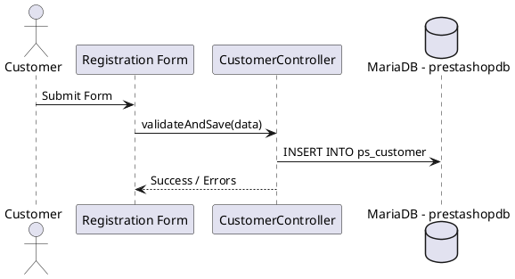
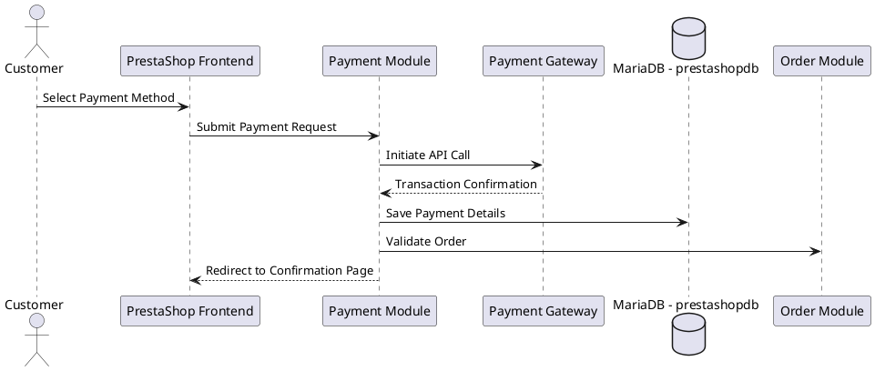

# Software Achitecture

# 1 INTRODUCTION
The chapter gives an overview of the design.

## 1.1 Purpose and coverage

This document provides a detailed overview of the software architecture for the ECSP1 eCommerce platform. It is intended for the implementation team, testers, DevOps engineers, and integration partners involved in building, deploying, or maintaining the system.

This document focuses on the system architecture, component interaction, deployment model, and security design. It excludes detailed user interface or database schema designs, which are documented separately.

## 1.2 Product and environment

**Product Name**: ECSP1 – eCommerce Service Platform

**Platform**: PrestaShop

**Purpose**: To provide a secure, modular, and scalable eCommerce environment for SMEs and entrepreneurs.

**Environment**:

- Server-side: Docker, Linux

- Client-side: Web Browser (modern HTML5 compatible)

- Infrastructure: Cloud-native (e.g., AWS, Azure, or on-prem), CI/CD (GitHub Actions, GitLab CI)

- Network: Internet, secured via HTTPS and firewalls

## 1.3 Definitions, notations and abbreviations

| **Term** | **Definition** |
|:-:|:-:|
| **CI/CD** | Continuous Integration / Continuous Deployment |
| **API** | Application Programming Interface |
| **SaaS** | Software as a Service |
| **HTTPS** | Secure Hypertext Transfer Protocol |
| **JWT** | JSON Web Token – used for secure authentication |
| **ORM** | Object-Relational Mapping |

## 1.4 References

List references to other sources (documents, standards, manuals, style guides, etc.) in alphabetical order by reference. References include the name, version, date, and where they can be found. Examples include:

  * [1] PrestaShop Developer Documentation (https://devdocs.prestashop-project.org/)

  * [2] OWASP Top 10 Security Recommendations

  * [3] ISO/IEC 27001 – Information Security Management Standard

  * [4] ECSP1 Requirement Specification v1.0 (internal document)

  * [5] CI/CD Pipeline Guidelines – ECSP1 Team Wiki

## 1.5 Overview of the document

This document defines the architecture of the ECSP1 eCommerce platform based on PrestaShop. It is structured to guide developers, testers, and DevOps engineers through the system’s core architectural decisions, technical environment, deployment setup, and modular structure.

- **Chapter 2** presents an overview of the system and application domain, including its integration into customer environments, hardware and software platforms, and boundary conditions.

- **Chapter 3** contains the architectural design, including design philosophy, modular decomposition, and key technology decisions. It also includes diagrams such as deployment and process flow.

- **Appendices** A-D provide supporting visuals including class diagrams, event sequence diagrams, database schema overview, and CI/CD pipeline flow.

- **References** Section includes external standards, regulations, and documentation that support this design.

# 2. SYSTEM OVERVIEW

## 2.1 Description of the application area

The ECSP1 platform is an eCommerce solution designed for small to medium enterprises, entrepreneurs, and non-technical users to create and manage their online shops. It enables product management, customer accounts, order tracking, secure payment, and analytics. The application domain is online retail and digital commerce, optimized for both desktop and mobile access.

## 2.2 The integration of the system into its environment

ECSP1 integrates into a wider technological ecosystem including:

- External payment gateways (e.g., PayPal, Stripe)

- Email authentication providers (e.g., Gmail OAuth2)

- Shipping APIs (e.g., UPS/DHL)

- Monitoring and backup systems (Prometheus, Grafana, rsync)

- It is also part of a larger DevOps pipeline where every change triggers automatic testing and deployment.

## 2.3 Hardware environment

- **Client Devices:** Desktops, laptops, tablets, smartphones (modern browsers)

- **Server Requirements:**

   * CPU: Quad-core x86_64 (min. 2.5 GHz)

   * RAM: Minimum 8 GB

   * Disk: SSD storage (min. 100 GB), daily backup capacity required

   * Network: 1 Gbps NIC or better

   * Hosted via VPS, cloud instance (AWS EC2 / Azure VM), or dedicated server

- **Peripheral Requirements:** None for the client. For some merchants, POS terminal API integration may be considered in the future.

## 2.4 Software Environment

- **Operating System:** Ubuntu Server 20.04 LTS (server), Windows/macOS/Linux (clients)

- **Platform:** PrestaShop 1.7.x

- **Web Server:** Apache 2.4+

- **Database:** MySQL 8.0

- **Backend Language:** PHP 7.4

- **Frontend Technologies:** HTML5, CSS3, JavaScript (optionally Vue.js/React if headless)

- **Authentication:** OAuth 2.0, JWT

- **Monitoring:** Prometheus, Grafana

- **Containerization:** Docker

- **Version Control:** Git (GitHub, GitLab)

- **CI/CD Tools:** GitHub Actions

## 2.5 Key boundary conditions for implementation

- The system **must** support Gmail login integration (CUSTOMER-REQ-0001)

- **Secure access** via HTTPS is mandatory

- Daily **automated backups** must be supported (CUSTOMER-REQ-0009)

- **Response time for user operations** must be below 2 seconds in 95% of interactions

- The system must be compliant with **GDPR and PCI-DSS** guidelines

- All code is written in **English**, including variable and function names, and follows PSR-12 coding standard

- Support for **multi-user roles:** Customer, Admin, Developer

## 2.6 Agreements and Standards

- **Documentation Standard:** Follows IEEE 1016-2009

- **Design Language:** UML for diagrams, Markdown for documentation

- **Security Guidelines:** OWASP Top 10 (latest), ISO/IEC 27001 referenced

- **Naming Conventions:** camelCase for variables, PascalCase for classes

- **Confidentiality:** The project is private; source code access is limited to project team members. Older versions must be encrypted and stored for a maximum of 6 months post-release, after which they are destroyed.

- **Reuse of Code:** Based on PrestaShop open-source modules and properly licensed third-party plugins

# 3. DESCRIPTION OF THE ARCHITECTURE

This chapter provides a detailed description of the PrestaShop system architecture, technology choices, modules, and database structure. It serves as a guide for installation, maintenance, and development.

**Description:**

- Customer and Admin users can use both the frontend and admin panel.

- Apache2 processes incoming HTTPS requests and provides the PrestaShop frontend.

- PrestaShop's business logic runs on PHP with PHP-FPM.

- MariaDB database stores data such as products, customers, orders.

- Optionally, a logging mechanism (e.g. Filebeat or ELK) can be integrated.

## 3.1 Design principles

- **Modularity:** PrestaShop is developed with a modular architecture. Core functions are separated from extensions (modules), allowing easy addition or update of functionalities.

- **Open Source:** The codebase is open source, enabling free customization.

- **MVC Pattern:** PrestaShop follows the Model-View-Controller (MVC) architectural pattern, facilitating development and maintenance.

- **Layered Architecture:** The application is divided into server layer (Apache), business logic layer (PHP), data layer (MariaDB), and client layer (HTML/CSS/JS).

- **Security:** User and admin sessions are managed with PHP security mechanisms. Data transfer is secured using HTTPS protocol.

## 3.2 Software architecture, modules and processes

- **Server Layer:** Apache2 web server running on Ubuntu 20.04 with PHP 7.4, configured with necessary PHP modules for PrestaShop.

- **Database Layer:** MariaDB stores all data including products, users, orders, and module data.

- **Frontend:** User-friendly and responsive interface developed with HTML5, CSS3, and JavaScript. JavaScript frameworks like jQuery can be integrated if needed.

- **Backend:** PHP-based core system implementing business logic. Functionality is extended via modules.

- **Modules:** Features such as order management, payment systems, and product catalogs are provided through modules.

- **Processes:** Apache and PHP-FPM handle client requests, while MariaDB manages data reads and writes.

## 3.3 Database Architecture

***Database Overview***

 **Database Name:** prestashopdb

 **Database Management System:** MariaDB 10.x

 **Tables:**

Includes core and supporting tables such as:

   - products

   - customers

   - orders

   - order_detail

   - categories

   - modules

   - languages

   - employee (user roles)

 **Relations:** 
Tables are connected using **primary keys (PK)** and **foreign keys (FK)** to maintain data consistency.

 **Backup Policy:**

Full daily backups are executed using mysqldump or equivalent.

Backups are stored offsite and monitored via cron jobs.

 **Security:**

- Database users follow the principle of least privilege.

- External connections require SSL/TLS.

- Admin user accounts are protected using hashed passwords.

 **Performance:**

- Indexes exist on frequently queried columns such as id_product, id_customer, and id_order.

- Query performance is monitored via slow query logging and optimized as needed.

*Entity-Relationship (ER) Diagram:*

*External System Integration Diagram:*

*Order Placement Sequence Diagram:*

## 3.4 Error and Exception Procedures

This section describes the general error and exception handling strategies implemented at the architectural level of the PrestaShop system. While module-specific procedures are covered in Chapter 4, the general principles defined here ensure consistent and maintainable error management across the entire stack.

**General Error Handling Rules**

- All critical backend components (PHP, MariaDB, Docker containers) are monitored and error logs are centralized.

- Errors are categorized based on severity: info, warning, error, and critical.

- PHP error reporting is configured to log all errors except notices in production (error_reporting = E_ALL & ~E_NOTICE).

- Frontend input validation is performed client-side using JavaScript and server-side in PHP to avoid security breaches and inconsistent states.

**Common Error Handling Modules**

- PHP’s native try-catch blocks are used in business logic to capture and handle exceptions.

- Symfony's exception handler (used by PrestaShop) routes unhandled exceptions to a centralized logger.

- Application logs are written using Monolog (built into PrestaShop) and stored in /var/logs.

**Recognition of Error Messages**

- User-visible errors are shown via PrestaShop’s built-in error templates.

- Internal system errors are tagged with unique error codes for debugging and support tracking.

- Payment and shipping gateway errors are parsed using their API-specific status/error codes.

**Saving Error Messages**

- Errors are written to disk inside PrestaShop logs:
/var/www/presta-shop-code/var/logs/prod.log

- Docker container-level errors are redirected to standard output and collected by docker logs.

- Database errors (e.g., failed insertions) are stored conditionally using transaction rollbacks and internal audit tables.

**Grouping of Error Messages**

- Errors are classified as:

   - ***System Errors:*** Unhandled exceptions, database connection failures, Docker container crashes.

   - ***User Errors:*** Form validation issues, incorrect credentials, or unauthorized actions.

   - ***Integration Errors:*** Failures in communication with external services (e.g., payment gateway timeouts).

**Error Message Texts**

- Error messages follow the multilingual format used by PrestaShop’s translation system.

- Texts are both human-readable and optionally include a developer-friendly debug code (e.g., PS-E1001 for "Cart update failed").

**Action in Abnormal Situations**

- **Power Outages:** If hosted on cloud infrastructure (e.g., CSC cPouta), virtual machines are configured to auto-reboot on crash. Docker containers are set with restart: always policy.

- **Database Connection Loss:** Backend modules retry connection using exponential backoff before failing gracefully.

- **Payment Failures:** If a transaction fails or times out, the order is placed in "Pending Payment" status and the customer is notified to retry.

# 4. MODULE / CATEGORY / PROCESS DESCRIPTIONS

## 4.1 Order Management Module

### 4.1.1 Overview

* **Module name:** Order Management Module

* **Module type:** Subsystem / PHP class group / Back Office module

* **Overview:**

This module is responsible for the full lifecycle of a customer's order, from creation and validation to payment status updates, shipping coordination, and invoice generation.
It is a core part of the e-commerce backend and integrates tightly with the product, customer, cart, and payment modules.

* **Customers (users of the module):**

    - Frontend controller (initiates order creation)

    - Admin panel (for order status updates, manual adjustments)

    - Payment module (payment confirmation)

    - Shipping carrier modules

* **Dependencies and Interfaces:**

    - Cart module (loads products & quantities)

    - Customer module (authenticates buyer)

    - Payment module (confirms transaction)

    - Carrier module (assigns shipping options)

    - Database (MariaDB – inserts and updates order-related tables like ps_orders, ps_order_detail, ps_order_payment)

### 4.1.2 Interface in general

This module exposes functions primarily through its main service classes and controllers (OrderController, OrderPaymentService, OrderHistory).
The module supports multi-language error handling and operates with robust transaction safety using Doctrine or native SQL transactions.

- Input validation is handled using PrestaShop's Validate class.

- Errors are raised using PrestaShopException and logged in /var/logs.

- In a typical use case, the frontend calls submitOrder() which orchestrates cart, customer, and payment validation before final creation.

*Sample interaction (Sequence Diagram):*

### 4.1.3 Interface Functions

**Function:** submitOrder(cart_id, customer_id)

* **Parameters:**

    - cart_id (int)

    - customer_id (int)

* **Returns:**

    - order_id on success

    - Exception on failure

* **Action:**

    - Validates cart and customer

    - Calculates totals, checks stock

    - Writes order data to DB

    - Confirms payment

* **Prerequisites:**

    - Customer is authenticated

    - Cart is not empty

* **Post-conditions:**

    - Order is stored in ps_orders

    - Payment record inserted

    - Cart is marked as ordered

* **Error Situations:**

    - Empty cart: CartEmptyException

    - Out of stock: StockUnavailableException

    - DB failure: PrestaShopDatabaseException

**Function:** cancelOrder(order_id)

* **Parameters:** order_id (int)

* **Returns:** Boolean (success/failure)

* **Action:**

    - Checks if the order is cancellable

    - Updates order status to “Canceled”

* **Prerequisites:**

    - Order is not shipped

* **Post-conditions:**

    - Order is marked canceled

    - Stock is restored

* **Error Situations:**

    - Order shipped: OrderNotCancellableException

### 4.1.4 Implementing the module

* **Internal Structures:**

    - Order data is stored in a combination of normalized tables: ps_orders, ps_order_detail, ps_order_state, and ps_order_payment.

    - Relationships are handled through foreign keys and PrestaShop’s ObjectModel system.

* **Algorithms Used:**

    - Automatic tax calculation based on geolocation

    - Order state transitions using a finite state machine design

    - Stock deduction using atomic DB operations

* **Reusable Components:**

    - OrderHistory for order state transitions

    - Tools::sendEmail() for notifications

    - Symfony Event Dispatcher for hooks

### 4.1.5 Error handling

- Each transactional operation (like submitOrder) uses DB transactions to ensure atomicity.

- Validation errors (e.g., bad cart ID, invalid address) are thrown as exceptions with i18n-friendly messages.

- Critical errors (DB write failures, payment gateway issues) are logged to prod.log and shown as generic messages to the user.

- Admin users can review error logs in the back office (Advanced Parameters → Logs).

- Graceful degradation is applied—e.g., if invoice PDF generation fails, order is still placed but marked for admin review.

## 4.2 Product Management Module 

### 4.2.1 Overview

* **Module name:** Product Management Module

* **Module type:** Subsystem / Admin Panel Module / ObjectModel Classes

* **Overview:**

This module is responsible for the creation, modification, categorization, and deletion of products in the PrestaShop system. It supports multi-language product details, advanced pricing rules, combinations (variations), and SEO settings.

* **Customers (users of the module):**

    - Admins (via Back Office)

    - Import modules (via CSV or API)

    - Frontend Product Listing (read-only)

* **Dependencies and Interfaces:**

    - Category module (for product grouping)

    - Stock module (for quantity management)

    - PriceRules module (for discounts and taxes)

    - Image module (for image uploads and galleries)

    - Search module (for product indexing and filters)

### 4.2.2 Interface in General

The module exposes an interface primarily through the Back Office (product controller) and via Webservices (API). All product data is stored in normalized tables such as ps_product, ps_product_lang, ps_product_shop, and related entities.

Common interface features:

- Auto-validation of required fields (name, price, quantity).

- SEO validation (meta title/description).

- Error messages use PrestaShop's localization and translation features.

- Product creation events can trigger hooks for additional customization.

*Sample usage flow (sequence diagram):*

### 4.2.3 Interface Functions

**Function:** addProduct(data)

* **Parameters:**

    - data (associative array with product fields)

* **Returns:** Product ID on success

* **Action:**

    - Validates fields

    - Saves product data in ps_product, ps_product_lang, etc.

* **Prerequisites:**

    - Admin privileges

* **Post-conditions:**

    - Product becomes visible in Frontend (if active)

* **Error Situations:**

    - Missing required field: ProductFieldException

    - Duplicate reference: DuplicateProductReferenceException

**Function:** updateProduct(product_id, data)

* **Parameters:** product_id, data

* **Action:** Updates existing product records

* **Post-conditions:** New data reflected in backend and frontend

**Function:** deleteProduct(product_id)

* **Action:**

    - Soft-deletes product and removes it from listings

* **Error Situations:**

    - Linked to active orders: ProductDeletionRestrictedException

### 4.2.4 Implementing the Module

* **Internal Data Structures:**

    - Product data split across several tables (ps_product, ps_product_lang, ps_product_shop, ps_stock_available)

    - Images stored separately and linked by ID

    - Variants managed using ps_product_attribute and related tables

* **Algorithms and Features:**

    - Automatically generates friendly URLs from product names

    - Calculates tax-inclusive prices based on customer group and location

    - Image resizing for thumbnails and listing view

* **Reusable Components:**

    - Product ObjectModel class

    - ProductController (Back Office)

    - AdminImportController for bulk import

### 4.2.5 Error Handling

- Validation errors shown inline on the admin product form.

- Server-side errors logged via Logger::addLog() and displayed in Admin logs.

- File/image upload failures trigger user-friendly messages.

- Product save is transactional – failure at any step rolls back changes.

- Custom hooks (actionProductAdd, actionProductUpdate) allow third-party modules to handle additional exceptions gracefully. 

## 4.3 Customer Management Module

### 4.3.1 Overview

* **Module name:** Customer Management Module

* **Module type:** Subsystem / Core ObjectModel / Controller / API

* **Overview:**

This module handles the management of customer data, including registration, authentication, account updates, and customer segmentation. It provides secure storage of personal data and integrates with GDPR tools, customer groups, and marketing modules.

* **Customers (users of the module):**

    - Customers (via Frontend)

    - Admins (via Back Office)

    - Modules that require customer data (e.g., Loyalty, Newsletter, GDPR)

* **Dependencies and Interfaces:**

    - Address module (for storing shipping/billing addresses)

    - Order module (for customer order history)

    - Group module (for price rules, customer segmentation)

    - Authentication service (login/session management)

### 4.3.2 Interface in General

The Customer Management Module exposes its functionality through:

- Front Office account pages (login, registration, profile management).

- Back Office customer controller.

- Webservice API (for external CRMs or ERPs).

- Standard hooks like actionCustomerAccountAdd, actionCustomerLogoutAfter, etc.

*Main features include:*

- Form validation for personal information and email format.

- Passwords stored securely using bcrypt.

- Ability to handle multiple addresses per customer.

- Support for GDPR compliance (right to access, erase, anonymize).

*Sequence Diagram - Customer Registration Flow:*

### 4.3.3 Interface Functions

**Function:** registerCustomer(data)

* **Parameters:**

    - data: associative array with customer fields (email, name, password, etc.)

* **Returns:** Customer ID or error

* **Action:**

    - Validates inputs

    - Hashes password

    - Creates customer record in ps_customer

* **Preconditions:**

    - Email must be unique

* **Postconditions:**

    - Customer is created and may log in

* **Error Situations:**

    - EmailAlreadyUsedException

    - InvalidPasswordFormatException

**Function:** loginCustomer(email, password)

* **Returns:** Session token or error

* **Action:**

    - Validates credentials

    - Starts session

* **Error:**

    - AuthenticationFailedException

**Function:** updateCustomer(customer_id, data)

* Updates customer profile details like name, password, preferences.

**Function:** deleteCustomer(customer_id)

* Triggers anonymization of customer data for GDPR compliance.

### 4.3.4 Implementing the Module

* **Internal Data Structures:**

    - ps_customer (core table)

    - ps_address (linked via id_customer)

    - ps_customer_group, ps_customer_message, ps_orders (related tables)

* **Security:**

    - Uses bcrypt for passwords

    - Email addresses and personal data are encrypted in backups

* **Third-party Integrations:**

    - Hooks for newsletter opt-in, loyalty points, and external CRM sync

* **Reusable Components:**

    - Customer ObjectModel class

    - CustomerController, AuthController, MyAccountController

### 4.3.5 Error Handling

* **Frontend Validation:**

    - Real-time error display on registration/login forms

* **Backend Handling:**

    - All validation failures logged via Logger::addLog()

    - Failed login attempts tracked for brute-force protection

* **Exceptions:**

    - Gracefully handled and translated into user messages

* **Fallbacks:**

    - In the event of DB failure, customer receives a generic error and the system logs the incident

* **GDPR Tools:**

    - Errors during anonymization or data access are logged and reported in Admin

## 4.4 Payment Module

### 4.4.1 Overview

* **Module Name:** Payment Module

* **Module Type:** Subsystem / PrestaShop Module / Controller

* **Overview:**

This module handles all operations related to payment processing within PrestaShop. It supports multiple payment gateways (such as PayPal, Stripe, bank wire, etc.) through modular plugins. It manages the flow from payment method selection to transaction validation, integrating with the order process.

* **Customers (users of the module):**

    - Frontend Checkout Process

    - Admin Panel (for transaction monitoring)

    - External Payment Gateways (via APIs)

* **Dependencies and Interfaces:**

    - Order module (to finalize purchases)

    - Cart module (for retrieving total amounts)

    - Hook system (actionValidateOrder, paymentReturn, etc.)

    - Payment gateway APIs (e.g., Stripe, PayPal SDKs)

### 4.4.2 Interface in General

The Payment Module offers:

* A set of hooks used during checkout:

    - displayPayment, paymentOptions, actionPaymentConfirmation, paymentReturn

* Secure token-based callbacks from payment providers.

* Transaction state management: pending, authorized, failed, captured, refunded.

* Standardized interface for module developers via PaymentModule abstract class.

*Payment Flow – Sequence Diagram:*

### 4.4.3 Interface Functions

**Function:** hookPaymentOptions($params)

* **Returns:** Payment option object(s)

* **Action:**

    - Returns available payment options based on cart total, currency, customer group

* **Error Situations:**

    - Missing credentials, misconfigured module

**Function:** validateOrder($id_cart, $id_order_state, $amount, $payment_method, ...)

* **Returns:** Order ID

* **Action:**

    - Creates order, updates order status, logs payment

* **Preconditions:**

    - Valid cart and payment configuration

* **Postconditions:**

    - New order is saved

* **Errors:**

    - Throws exception on DB failure or invalid cart

**Function:** handleCallback(Request $request)

* **Returns:** Success or Error Response

* **Action:**

    - Verifies token and status

    - Updates order status

    - Saves transaction ID

**Function:** refund($transaction_id, $amount)

* Processes partial or full refunds using API credentials

### 4.4.4 Implementing the Module

* **Internal Data Structures:**

    - ps_orders, ps_order_payment, ps_module, ps_order_state

* **Implementation Highlights:**

    - Based on PaymentModule abstract class

    - Admin configuration form built with HelperForm

    - Uses PrestaShop’s secure key/token for gateway validation

* **Reusable Components:**

    - API clients (cURL or SDK for PayPal/Stripe/etc.)

    - Payment form templates and hook renderers

    - Logger for capturing transaction issues

### 4.4.5 Error Handling

* **Frontend:**

    - Displays clear messages for payment errors (e.g., card declined, invalid configuration)

* **Backend:**

    - Payment failures logged via PrestaShopLogger::addLog()

    - Admins notified of gateway errors via dashboard or email

* **Gateway Callback Errors:**

    - Invalid callbacks are rejected and logged

    - Gateway failures do not trigger order validation

* **Timeouts / API errors:**

    - Retry logic or manual validation instructions shown to admin

* **Security:**

    - Transactions verified with tokens and API keys

    - Sensitive keys stored encrypted in database or configuration

# 5. FINISHED COMPONENTS AND SPECIAL TECHNICAL SOLUTIONS

This section outlines the third-party components, external modules, and unique technical solutions integrated into the PrestaShop-based system. These are either reused open-source tools, external services, or custom-developed features that deviate from standard implementations.

## 5.1 Finished Components
| **Component** | **Source / Location** | **Usage** | **Notes** |
|:-:|:-:|:-:|:-:|
| **PrestaShop 1.7 Core** | https://www.prestashop.com | Foundation eCommerce framework | Installed on project root directory |
| **Stripe Payment Module** | Addons Marketplace | Processes card payments | Must be configured with API keys |
| **PayPal Official Module** | Addons Marketplace com | PayPal integration for orders | Uses OAuth2.0 and IPN callbacks |
| **Mailjet Integration** | Custom module (internal repo) | Transactional email services | Configured via back office |
| **Redis Cache Module** | External (PrestaShop Addon) com | Enhances performance via caching | Requires Redis server installed |
| **MariaDB** | Ubuntu APT Repo (v10.x)| Primary database | Hosted in Docker container |
| **Adminer** | External (adminer.org) | Lightweight DB management| Dev environment only|

## 5.2 Special Technical Solutions

Below are notable deviations from default or typical configurations, employed to meet business or technical requirements:

**Custom Security Hardening**

-	Admin folder renamed for security.

-	Two-factor authentication enabled via third-party login module.

-	CSRF token validation enforced on all public-facing forms.

-	Direct SQL queries avoided; ORM and parameterized queries preferred.

**Custom Backup Strategy**

-	Full database backups taken daily via cronjob (mysqldump).

-	Application files (themes, modules, uploads) archived weekly.

-	Remote backups stored securely on S3-compatible object storage.

**Recovery & Fault Tolerance**

-	In the event of a power outage or crash:

    * Docker containers auto-restart via restart: always.

    * MariaDB is configured with innodb_force_recovery levels to aid crash recovery.

-	Logs are persisted and monitored using external Logger_Container.

**Maintainability Enhancements**

-	All custom code is stored in /modules/custom-*/ directory.

-	Version-controlled using Git with CI checks on commit.

-	Module documentation and changelogs maintained in README.md.

**Performance Optimizations**

-	Redis caching enabled for sessions and object cache.

-	SQL indexes added manually for slow queries (based on slow query log analysis).

-	Minified assets and lazy loading enabled in themes.

**Portability**

-	Full system runs in Docker containers:

    * Frontend, Backend, MariaDB, Redis, Mailjet, Logger.

-	.env files define environment-specific variables, allowing quick migration.
**Unconventional Implementations**

-	The checkout page combines guest checkout and login into a single UX flow using JavaScript injection.

-	To support multilingual SEO, language-based URL rewriting logic is extended beyond PrestaShop default.

## 5.3 Toolchain and Infrastructure

While implementation tools are typically detailed in the project plan, the following tools have significant architectural implications:

| **Tool** | **Purpose** | **Notes** |
|:-:|:-:|:-:|
| **Docker Compose** | Container orchestration| Ensures modular, reproducible development & deployment| 
| **GitLab CI/CD** | Deployment automation| Runs tests, builds Docker images, pushes to production| 
| **VS Code + PrestaShop Helper** | Development| Plugin used for class autocompletion and hook references| 
| **PHPStan / ESLint** | Static analysis| Integrated in CI pipeline| 
| **Adminer** | DB admin| Lightweight alternative to phpMyAdmin in local| 

# 6. SOLVED SOLUTIONS

Considered, but rejected, solutions should be recorded with their rationale in an appropriate chapter or section with dates. Thus, the next reader of the document sees that something has been thought about as well. Also, if you are reading a design document yourself in six months, it may be difficult to remember what things have been considered when making the system.

At the end of the project, the rejected solution options are collected at the end of the project plan

# 7. FURTHER DEVELOPMENT IDEAS

Gather useful ideas that come to mind along the way, but which are not planned or implemented in this project; for example due to lack of time, lack of money, lack of resources or skills and competences.
For example, ideas for further development should be numbered to make it easier to refer to them later. The date and the name (letters) of the proposer will help in the follow-up, especially if the source is outside the project, if after one year the project unexpectedly receives funding for further development.
At the end of the project, this chapter is collected at the end of the project plan. The ideas for further development can also be presented as a separate appendix, which can be appended to other project documents if necessary. 

## 7. IDEAS FOR FURTHER DEVELOPMENT

Gather useful ideas that come to mind along the way, but which are not planned or implemented in this project; for example due to lack of time, lack of money, lack of resources or skills and competences.
For example, ideas for further development should be numbered to make it easier to refer to them later. The date and the name (letters) of the proposer will help in the follow-up, especially if the source is outside the project, if after one year the project unexpectedly receives funding for further development.
At the end of the project, this chapter is collected at the end of the project plan. The ideas for further development can also be presented as a separate appendix, which can be appended to other project documents if necessary.

## 8. ITEMS STILL OPEN

The figure is unofficial and should no longer be at the end of the project. This can be used to mark issues that are open during the life cycle of the document, ie that need to be resolved, so that they can be clarified before the document is finally completed.

**FUTURE ADDITIONS**

## Software architecture thought like Zachman

* Framework and 4+1 View Model
* Reference Model for Open Distributed Processing (RM-ODP)

1. Enterprise viewpoint --> Business Case
2. Information viewpoint -- >
3. Computational viewpoint
4. Engineering viewpoint
5. Technology viewpoint

* Link Jari Suni here :)

**Original Source** http://www.cs.tut.fi/ohj/dokumenttipohjat/pohjat/suunnittelu/hytt_drsuunnittelu.doc

**Thank you for original authors!**

