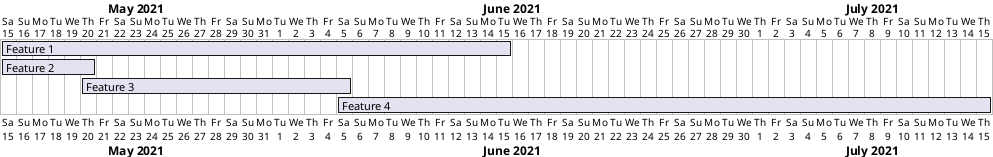

# Release Plan (Template)

## Gantt-chart with PlantUML -notation

The easiest way of presenting the feature releases during development is via visual version of the release plan.

OR ADD here GITLAB EPIC ROADMAP ???

The following table shows the features to be released in each patch.

**Patch "EarlyAdopter"**

Version 1.0

**Configuration**

| Feature | Version | Can be tested | To be released |
|:-:|:-:|:-:|:-:|
| [Feature 1]() | 1.0 | x.y.201z | x+2,y+3.201z |
| [Feature 2]() | 1.0 | x.y.201z | x+2,y+3.201z |
| [Feature 3]() | 1.1 | x.y.201z | x+2,y+3.201z |
| [Feature 4]() | 1.1 | x.y.201z | x+2,y+3.201z |
| [Feature 5]() | 2.3 | x.y.201z | x+2,y+3.201z |
| [Feature 6]() | 0.9 | x.y.201z | x+2,y+3.201z |
| [Feature 7]() | 1.1 | x.y.201z | x+2,y+3.201z |

**Patch "EarlyAdopter Enhanced"**

Version 1.1

**Configuration**

| Feature | Version | Can be tested | To be released |
|:-:|:-:|:-:|:-:|
| [Feature 1]() | 1.0 | x.y.201z | x+2,y+3.201z |
| [Feature 2]() | 1.1 | x.y.201z | x+2,y+3.201z |
| [Feature 3]() | 1.1 | x.y.201z | x+2,y+3.201z |
| [Feature 4]() | 1.1 | x.y.201z | x+2,y+3.201z |
| [Feature 5]() | 2.5 | x.y.201z | x+2,y+3.201z |
| [Feature 6]() | 0.9 | x.y.201z | x+2,y+3.201z |
| [Feature 7]() | 1.2 | x.y.201z | x+2,y+3.201z |

**Patch "EarlyAdopter Enhanced and stabilized"**

Version 1.2

**Configuration**

| Feature | Version | Can be tested | To be released |
|:-:|:-:|:-:|:-:|
| [Feature 1]() | 1.0 | x.y.201z | x+2,y+3.201z |
| [Feature 2]() | 1.2 | x.y.201z | x+2,y+3.201z |
| [Feature 3]() | 1.1 | x.y.201z | x+2,y+3.201z |
| [Feature 4]() | 1.1 | x.y.201z | x+2,y+3.201z |
| [Feature 5]() | 2.5 | x.y.201z | x+2,y+3.201z |
| [Feature 6]() | 0.9 | x.y.201z | x+2,y+3.201z |
| [Feature 7]() | 1.3 | x.y.201z | x+2,y+3.201z |
